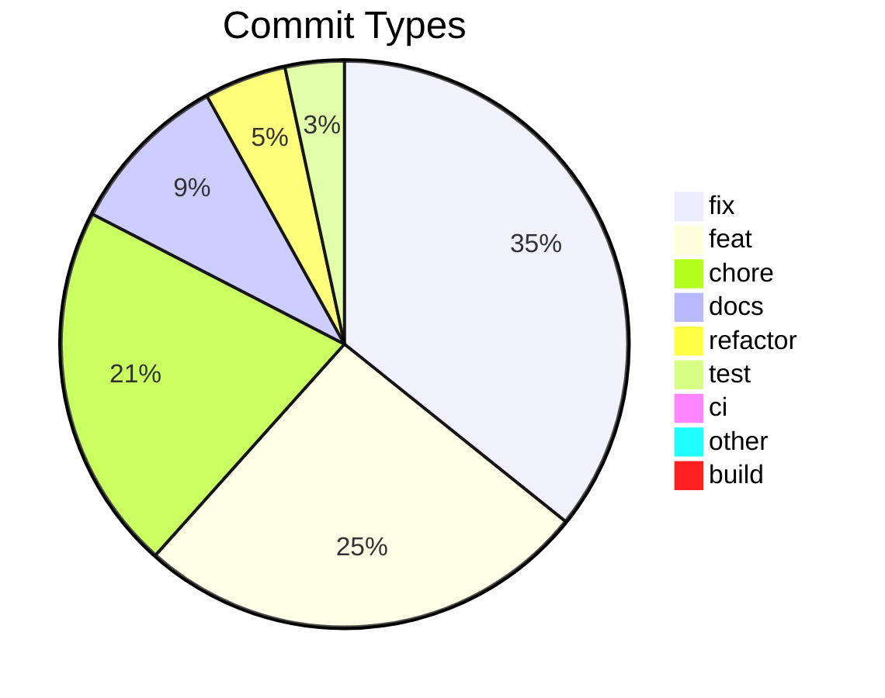

# Commit Change Log

Generated: 2026-06-12T05:34:33.501385+00:00
Total commits: 543

## Commit Distribution

## Changes by Type

### Fixes (fix) — 191 commits

| Date | Scope | Description | Commit |
|------|-------|-------------|--------|
| 2026-06-12 | triage | route idle-main status flips to the outbox (mirror mark_status) (#124) | 820210949f5b |
| 2026-06-09 | terminal | force full-viewport WebGL repaint on scroll to kill table smear | 1bed8a83ba41 |
| 2026-06-09 | campaigns | show live per-step in_progress on the board from loop_state.json | 28c7559a47d5 |
| 2026-06-08 | triage | union tracked ∪ outbox in the webui reader + residence-derived status writes | a7ef0419ca2d |
| 2026-06-08 | campaigns | guard against double-launching an autonomous run | aa88b4f117b4 |
| 2026-06-08 | terminal | force full-viewport repaint after replay-drain settle | 4895bcd2b8f8 |
| 2026-06-07 | compliance | opt into A5.6 Phase B (a5_phase_b_activated) to clear false-positive | 9bed675a61ec |
| 2026-06-07 | terminal | touch-scroll routes by xterm buffer type (ADR-132) | 192fa2eb66e2 |
| 2026-06-05 | campaigns | hide done==total campaigns from the lane (FR-01.33) | 5bf5d571671d |
| 2026-06-05 | compliance | webui audit data/config reconcile — G2 scopes + event FR links (C4) | f8b63cbbe8d6 |
| 2026-06-04 | campaigns | parse Sub-Iterates table by header + strip MD emphasis | 7a0802d03b17 |
| 2026-06-04 | security | remediate vitest CVE-2026-47429 (CVSS 9.8) + vitest 4 test compat | 7187f28f8948 |
| 2026-06-04 | ci | gate server type-check and correct the security critical-findings gate | 9d096a167308 |
| 2026-06-03 | smartviewer | preserve frontmatter + line endings in markdown editor round-trip | 89f84afe5db3 |
| 2026-06-03 | media | harden Range stream errors + cover start>end 416 (external review) | 21d1f6842b51 |
| 2026-06-02 | terminal | gate idle-ceiling on client attachment to stop resume data-loss | 47f74501b5dc |
| 2026-05-31 | taskboard | wire Re-open into TaskCard + repair tests & E2E | 1dc588591d42 |
| 2026-05-31 | terminal | reap stale WS writer slot via ping/pong liveness keepalive | dc7f23d33301 |
| 2026-05-29 | transcript | render mode/pr-link/stop-hook events + intent-based scroll detach | 7573e84a00cd |
| 2026-05-29 | client | clear CTA label-reset timers on unmount (teardown-leak flake) | 525fd1f2a597 |
| 2026-05-27 | webui | phase pill no longer derives Build from "Fix"-titled iterates | ce60cf78e94e |
| 2026-05-27 | terminal | trim routes.ts comment 1 LOC to land at exact baseline | 9bf3426a3d6e |
| 2026-05-27 | terminal | refine ready.ptyReused to hadPriorWriter (atomic snapshot) | ff6a6d254722 |
| 2026-05-26 | adr | renumber ADR-124 → ADR-126 + remove stray conflict marker | bb8ff0864d0f |
| 2026-05-25 | client/terminal | one-finger pan-to-scroll on touchscreens | 4a2138f91481 |
| 2026-05-25 | server/external | tree route honours .gitignore directory-form negations | 5c7f53955e36 |
| 2026-05-23 | test | retarget doc-sync to follow Phase 0f file-map move | bde108f83300 |
| 2026-05-23 | terminal | refit + refresh on tab activation (render-broken repair) | 207f5c362f5e |
| 2026-05-22 | compliance | G2 stoplist + regen artifacts (bloat from C.2 detector rollout) | 5c89262cf08f |
| 2026-05-22 | server | SPA fallback to client/dist/index.html for non-/api GETs | 55d0288bdde4 |
| 2026-05-21 | terminal | stop replay-only WS reconnect loop on closed tasks | 501d3ac008fc |
| 2026-05-22 | triage | Fix-now pre-selects the triage item's project in NewIssueModal | 32b7320f6208 |
| 2026-05-19 | inbox | tighten card-internal top padding | e87f55812886 |
| 2026-05-19 | triage | assign new-iterate actionId on promote so launch injects the brief | 6e6d24a58cf3 |
| 2026-05-19 | launch | flatten newlines in task descriptions instead of rejecting them | da9e63b403a1 |
| 2026-05-19 | triage | carry the triage item detail into the promoted task description | 484828cb8d7c |
| 2026-05-19 | scripts | build the client too in start-server-production.ps1 | 8bdfb07c504c |
| 2026-05-19 | actions | emit --name as one cleanly-quoted token via {task.session_name} | 78759fee03d2 |
| 2026-05-18 | launch | carry the persisted task description on every fresh launch | 7cce153d04ed |
| 2026-05-18 | terminal | restore cursor visibility (DECTCEM) in replay snapshots | f2cfd7fcb5b7 |
| 2026-05-18 | terminal | arm one-shot inject guard on a reused pty (survives reload) | 0e850b825dbf |
| 2026-05-16 | build | copy non-TS runtime assets into dist/ | 6ce1a042d76f |
| 2026-05-16 | terminal | convertEol false eliminates left-column scroll smear (Bug B) | 3f87321a091a |
| 2026-05-16 | terminal | replay drain gate eliminates reattach smear (ADR-108) | 0da4701cea6b |
| 2026-05-15 | terminal | replay-snapshot remount smear + reset banner (ADR-104) | 89a133c0154f |
| 2026-05-15 | triage | resolve 500 on Promote/Dismiss/Snooze (lock collision + self-deadlock) | a660f34da85a |
| 2026-05-15 | resume-cta | gate Resume on live JSONL write-time, not embedded-pty signal | 4049a56dd240 |
| 2026-05-15 | task-detail | redirect to task board after closing a task | 0741a6cd163e |
| 2026-05-15 | triage | apply external-code-review fixes missed by PR #17 staging | b2f460d425d1 |
| 2026-05-15 | terminal | Iterate M (Resume CTA active-state) + K v10 (post-replay maintenance) | b62f73e9f453 |
| 2026-05-14 | terminal | post-launch-settle backstop for Resume-click-in-long-mounted-tab (ADR-099 v9) | 005e099a2676 |
| 2026-05-14 | terminal | atlas-corruption workaround completes scroll-during-streaming (ADR-099 v8 + probe) | 1d5cc62695ba |
| 2026-05-14 | terminal | post-mount maintenance for Resume-after-reload (ADR-099 v7) | a09d76f5badd |
| 2026-05-14 | terminal | immediate atlas maintenance on burst-after-quiet (ADR-099 v6) | 000b1b61e1bb |
| 2026-05-14 | terminal | lightweight refresh in alt-screen for stale cursor (ADR-099 v5) | b31834b9b45e |
| 2026-05-14 | terminal | skip atlas-clear in alt-screen buffer (ADR-099 v4) | 1085998f01c6 |
| 2026-05-14 | client | swallow ECONN* in Vite dev WS proxy (ADR-099) | 95366dacd2c0 |
| 2026-05-14 | terminal | conditional atlas clear — skip when terminal idle (ADR-099) | d9a0d683e9f8 |
| 2026-05-14 | terminal | tighten atlas-clear interval + add term.refresh() (ADR-099) | c3979f494429 |
| 2026-05-14 | terminal | periodic + on-scroll clearTextureAtlas workaround (ADR-099) | 7fe9f4166684 |
| 2026-05-14 | terminal | re-emit SGR mouse encoding after snapshot replay (ADR-099) | 980c71304ef2 |
| 2026-05-14 | terminal | WebGL load-order + rescaleOverlappingGlyphs (ADR-099) | b0747d02f070 |
| 2026-05-14 | server | refine new-plain Resume gate — emit --resume when JSONL exists | e5549a5fae9c |
| 2026-05-14 | client | drop liveSession gating — Resume CTA always shows on idle/active | c3f403fcf9e5 |
| 2026-05-13 | server | restore CLAUDE_CODE_NO_FLICKER=1 default (ADR-098 — Claude Code #37283 unresolved) | 84c4045d3b82 |
| 2026-05-13 | server,client | preserve snapshot on pty-death + TaskCard Resume gating (ADR-096) | cf6a8835b50b |
| 2026-05-13 | server,client | Claude TUI flicker env + Resume button gating (ADR-095) | 76828b132d4e |
| 2026-05-13 | client | xterm.js Vorbild-Alignment — convertEol+WebGL+scrollback+proposedApi (ADR-093) | 87e1d55a1470 |
| 2026-05-12 | server | live-pty replay via serialize-on-attach + snapshot-on-detach (ADR-092) | 32ad3f49564b |
| 2026-05-12 | server | mark @xterm/headless fixture as binary; pin LF-normalized size | 508b90fe50fa |
| 2026-05-11 | server | skip disk-scrollback replay for new-plain on WS attach (ADR-086 v0.9.4) | 312549ca171a |
| 2026-05-11 | server | new-plain Resume converges to active state (ADR-085 v0.9.3) | c937225e4ff6 |
| 2026-05-11 | client | embedded-terminal mount-race regressions (ADR-084 v0.9.2) | ca607e8aa4d7 |
| 2026-05-11 | server,test | wire boot-time Trusted-Origin policy into WS upgrade gate (ADR-083) | 7a11eaa579ec |
| 2026-05-11 | cli-compat | use platform-aware path module in selfHealClaudePath | 8ccd0283a986 |
| 2026-05-10 | server | wire SHIPWRIGHT_NETWORK_PROFILE into Trusted-Origin policy | 62104e26c2a4 |
| 2026-05-10 | client | accept MagicDNS hostnames in Vite allowedHosts for tailscale profile | 76b66f5e9415 |
| 2026-05-10 | dev | wire .env.local into both dev-server processes (ADR-082) | c406414844e5 |
| 2026-05-09 | server,build | retire 4 documented tsc baseline errors (ADR-080) | d063dedecc3c |
| 2026-05-09 | client | v0.8.9 — embedded-terminal replay-pushdown so live shell renders at viewport top | 2b54c35a6e64 |
| 2026-05-08 | server,test | v0.8.8 — apply external code-review fixes (gemini + openai) | 3390a30c41f6 |
| 2026-05-08 | server,client | v0.8.7 — apply external code-review fixes (gemini + openai) | fd69a71a7f71 |
| 2026-05-08 | server | v0.8.7 Stage 0 — new-plain `active → idle` when pty is gone (AC-1) | 53bfad0ff067 |
| 2026-05-08 | terminal | v0.8.6 follow-up — scroll xterm to bottom after replay_end | b8ace0903a38 |
| 2026-05-07 | terminal | v0.8.6 Stage 1+2+3 — resize-dedupe kills banner accumulation (AC-2/AC-3); Spec 82 + AC-4 fix | 1d5ce26f52fe |
| 2026-05-07 | client | v0.8.6 Stage 1+2+3 — Spec 82 empirical regression + AC-4 fix | 43b47fc701a3 |
| 2026-05-07 | terminal | v0.8.6 Stage 0 — drop rounded corners on terminal wrapper (AC-1) | 90b2b124964b |
| 2026-05-07 | server | v0.8.5 Stage 3 — new-plain tasks transition to active on pty-up (AC-4) | e557e50d6de4 |
| 2026-05-07 | terminal | v0.8.5 Stage 2 — defensive xterm clear on replay_start (AC-3) | 60b0101224cb |
| 2026-05-07 | terminal | v0.8.5 Stage 1 — remove Ctrl+V handler (AC-2) + Terminal-tab CTA (AC-6) | 1664cbc54e5a |
| 2026-05-07 | terminal | v0.8.5 Stage 0 — visual padding inside dark canvas (AC-1) | 1b8522b070b2 |
| 2026-05-07 | server | v0.8.4 — Trusted-Origin gate honors HONO_HOST + WEBUI_TRUSTED_ORIGINS opt-in | 501e55686414 |
| 2026-05-07 | terminal | v0.8.3 follow-up — FileReader polyfill for jsdom Blob.text() | d0f1da366af2 |
| 2026-05-07 | terminal | v0.8.3 Stage 2 — terminal canvas padding + footer inset | fd7bb0547fcb |
| 2026-05-07 | terminal | v0.8.3 Stage 1 — real Ctrl+V paste via attachCustomKeyEventHandler + clipboard.read | 46a3144e20ef |
| 2026-05-06 | terminal | v0.8.2 follow-up — disclosure null-handling, Show-ignored toggle, live smoke spec 79 | 7ad01688f0de |
| 2026-05-06 | terminal | v0.8.2 polish — Spec 74 modal flake + xterm dark theme + Ctrl+V parity + paste latency + paste-dir migration + replay-only mode | 4003ea0a0ded |
| 2026-05-05 | terminal | post-v0.8 stabilization — scrollback ANSI sanitizer + writer-stuck watchdog | 1620245d570c |
| 2026-05-05 | ui | suppress phase pill for Plain Claude tasks across all 3 surfaces | e713eba02e20 |
| 2026-05-05 | terminal | post-finalization UAT-fold — auto-launch reader→writer race + cumulative session fixes | 1d48845963cf |
| 2026-05-05 | terminal | Codex final-pass fold — Terminal CTA pure tab-flip + AC-16 about-to-run preview | 82b67f534804 |
| 2026-05-05 | terminal | post-Phase-5 review fold — separate Stop terminal action + honest TTL disclosure copy | a64f4f11fdd6 |
| 2026-05-05 | terminal | post-Phase-3 external code review fold (8 HIGH + 4 MEDIUM) | 191d1e31f10e |
| 2026-05-04 | terminal | live-smoke-driven UX hardening (ADR-067 phase 6.2) | f80cb1fb5e34 |
| 2026-05-04 | terminal | post-second-review hardening + integration smoke fixes (ADR-067 phase 6.1) | 55b91f76deb7 |
| 2026-05-03 | terminal | post-code-review hardening (ADR-067 phase 6) | 07146b30c6c3 |
| 2026-05-02 | transcript | persist virtualizer measurements + cold-cache warmup (ADR-066) | 8628745a3e77 |
| 2026-05-01 | transcript | drop null-rendering events upstream of virtualizer (ADR-065) | 9946325c9fa8 |
| 2026-05-01 | transcript | disable browser scroll-anchoring in virtualized branch | fb2c6a902929 |
| 2026-05-01 | transcript | stabilize virtualized scroll-up with stable keys + frame-batched measurement | e8fd466209c0 |
| 2026-05-01 | transcript | render Claude Code task-notifications as a status chip | 789c05b6dab2 |
| 2026-05-01 | webui | clicking a Projects row opens its TaskBoard, not Settings | 322bf22f7da0 |
| 2026-04-26 | webui | TaskList Phase column actually renders the phase | 8a80c27f17e5 |
| 2026-04-26 | webui | phase persists across all launch paths + tighten title regex | c3fdf18a44f0 |
| 2026-04-25 | webui | ProjectContextStrip stops wrapping on narrow modal | 374b6afdd201 |
| 2026-04-25 | webui | unified ParamField alignment + phase fallback on TaskCard | b71869203def |
| 2026-04-25 | webui | opt-in Advanced parameters + initial-prompt preview | 2b6eed163851 |
| 2026-04-25 | webui | skill flags belong in initial-prompt, not as Claude CLI args | 6199f33dd737 |
| 2026-04-24 | webui | hono server — loud bind errors via formatBindError | 061b8f4342a4 |
| 2026-04-24 | webui | dev-restart — computeKillTargets helper, drop hardcoded 5177 | 5bd13af3c149 |
| 2026-04-24 | webui | tasklist-card-width — drop max-w-[90%] so it matches ToolCard | bd8a8e7d8b80 |
| 2026-04-24 | webui | hide last-prompt events from chat — pure noise | 1f5640f38977 |
| 2026-04-24 | webui | system-pill-filter — hide custom-title/agent-name/permission-mode by default | 2884c4fc060c |
| 2026-04-24 | webui | chat-bubble-padding — widen horizontal inset from 22px to 40px | 3912f987d632 |
| 2026-04-24 | webui | status-stuck-on-awaiting-launch — re-launch flips back to active | 0ee0801adf91 |
| 2026-04-23 | webui | tasklist-light-theme — switch TaskListCard from dark to light bg | ffa79f6e22c8 |
| 2026-04-23 | webui | skillcard-and-code-bg — unwrap array content + anthracite code | cc9da2c3dad0 |
| 2026-04-23 | webui | mermaid-render-loop-fix — stabilize ReactMarkdown config identity (real cause was poll-driven remount) | 9a16fd1b2f97 |
| 2026-04-23 | webui | mermaid-flicker-fix — move content-hash memo to DOM dataset for StrictMode resilience | 6c0d1acbdbd6 |
| 2026-04-23 | webui | resume-cwd-prefix — extend cd prefix to legacy buildCopyCommands (Resume/Fork parity with Launch) | 965b4678b1af |
| 2026-04-23 | webui | mermaid-in-markdown — render language-mermaid fences as SVG diagrams | 3dd14290a80d |
| 2026-04-23 | webui | launch-cwd-prefix — shell-aware cd injection so pasted commands run in project root | 822aea49e7a9 |
| 2026-04-23 | webui | cli-flag-fix — command template used --project-root, not a real Claude CLI flag | 6db145051e2b |
| 2026-04-23 | webui | shell-line-continuations — flatten copy command for PowerShell/cmd | 92460ee9dc6a |
| 2026-04-23 | webui | launch-command-wiring — route copied stub command, phase not persisted | 2b0a49992847 |
| 2026-04-20 | webui | omit --session-id on plain resume (CLI 2.1+ rejects the combo) | b9cc1fd639b0 |
| 2026-04-18 | webui/chat | AskUserCard multi-select + notBlocked banner + switch timeout | c67416484d2c |
| 2026-04-18 | webui/chat | UAT round 2 — new-task model, ghost bubble, resume UX, 409 retry | fd9f0014fc6e |
| 2026-04-18 | webui/chat | mid-task model switch UX + spawn indicator + empty-prompt guard | 692af8abf294 |
| 2026-04-18 | webui/e2e | correct TaskDetailPage URL in sub-iterate A spec | 1d571b4c0a85 |
| 2026-04-18 | webui/chat-settings | sub-iterate C — unify model state to concrete CLI ids | 8614ba7784f3 |
| 2026-04-17 | iterate14.14 | post-14.13 bug sweep (4 bugs) | 938dcfd8c5e0 |
| 2026-04-17 | iterate14.13 | send concrete model id + spawn/switch UX indicators | 820c6ce5475c |
| 2026-04-16 | iterate14.10 | opus 4.7 correct id + auto mode CLI mapping + askusercard pause resume | 2f3bed4ccadd |
| 2026-04-16 | iterate14.8.1 | filterbar phase drift + priority removal + modebadge inline | 485c7c203f5e |
| 2026-04-16 | iterate14.8.0 | kanban phase mapping wire-through + sensible defaults | b5ee744ffcbd |
| 2026-04-15 | iterate14.7.0 | task persistence + all-projects view + reload state | 49df59a97d44 |
| 2026-04-14 | webui,shared | iterate 12.0b — zombie-task reconciliation | 0171ba7eeb3a |
| 2026-04-14 | webui,plugins | revert inbox filter to latest-pending + expand phase dropdown | 8610bff5283c |
| 2026-04-14 | webui | drop /think slash prefixes — Claude CLI 2.1.1 removed them | 047b15016832 |
| 2026-04-14 | webui,iterate13.1 | suppress markdown fallback after resolved AskUserQuestion | 02a31296db99 |
| 2026-04-14 | webui,iterate | iterate 11.3 — first-pending inbox + replay timestamps + iterate-aware handoff | 31368610dec1 |
| 2026-04-13 | webui | inbox shows latest pending per task (revert iterate 11.1 zombie filter) | 8d3653fd40f5 |
| 2026-04-13 | webui | inbox dedupe by normalized question + zombie-task filter (ADR-024) | 16c338e09bee |
| 2026-04-13 | webui | revert iterate-7 tool_result stdin + inbox filter + model selector + finalization verifier | 1bf0c51f9700 |
| 2026-04-13 | webui | lock concurrent JSON writes (projects, pids, inbox, settings) | bd2c6bedceb3 |
| 2026-04-13 | hooks | filter shipwright runtime-artifact dirs from drift check | add0234c0fe6 |
| 2026-04-13 | webui | inbox projectId + chat-history replay + collapse AskUserQuestion noise + model/effort wire-through | 22d7cdc22091 |
| 2026-04-13 | webui | persist task_cancelled/work_completed/task_updated to events.jsonl | 6739e9db6989 |
| 2026-04-13 | webui | inbox answers send tool_result block + immediate Thinking + plugin scope + ADR budget | db0cc2f20bce |
| 2026-04-13 | webui | TaskHeader redirects to kanban board after Close/Delete | bcf8f06bed03 |
| 2026-04-13 | webui | fatal startup errors (EADDRINUSE) must exit for tsx watch to retry | 3c9e54fe2ed0 |
| 2026-04-13 | webui | reset displayContent per turn + inbox id=toolUseId + dev-restart helper | f12eb542ef4a |
| 2026-04-13 | webui | correct AskUserQuestion schema + orange accent + thinking label + restart note | f1abc39bbe6d |
| 2026-04-13 | webui | kill chat duplication at the root + AskUserCard redesign + classifier tiebreak | dc85a3c6b6a1 |
| 2026-04-13 | webui | AskUserQuestion card renders schema + dedupe double-render | a57207672764 |
| 2026-04-13 | webui | tool call cards transition Running→Done in place | 685b38f7e1e3 |
| 2026-04-13 | webui | phase dropdown now authoritative in both start paths | bc09bc21949f |
| 2026-04-12 | webui | compact task header + tighter chat top padding | 5de4d85950d7 |
| 2026-04-12 | webui | permission popover closes on select, user bubble darker | 00e1b7b68307 |
| 2026-04-12 | webui | white claude cards, grey user bubble, VS Code permission modes | 237cf5a294d3 |
| 2026-04-12 | webui | persistent Claude process via --input-format stream-json | bf3dbe908c0d |
| 2026-04-12 | webui | flat chat, markdown tables, earlier streaming indicator | 11e49c6c3e0e |
| 2026-04-12 | webui | chat rendering matches mockup 11 — avatars, tool tiles, no horizontal scroll | 8d292026dbbb |
| 2026-04-12 | webui | interactive chat via re-spawn with --resume | 60b5d99a770b |
| 2026-04-12 | webui | task lifecycle events — start transitions kanban status, exit completes task | 0dd81bfdb608 |
| 2026-04-12 | webui | kanban columns scroll vertically when tasks overflow | 7b924be9116b |
| 2026-04-12 | webui | add min-h-0 to enable scroll on kanban board container | 3136b3e964bf |
| 2026-04-12 | webui | enable page scrolling when tasks overflow viewport | 080a01c0c68f |
| 2026-04-12 | webui | bridge hardening — cross-platform stability | b8e2dbe12fc6 |
| 2026-04-12 | webui | bridge working — Claude CLI spawns, responds, files created | 402eb0008131 |
| 2026-04-12 | webui | CLI prompt sends title+desc, server crash fix, Windows auto-start | c446982e6e8a |
| 2026-04-12 | webui | test phase — title/desc split, autonomy refactor, model display, start button | 7482bf6bfeab |
| 2026-04-11 | webui | PATCH URL, card menu Close+Delete, chat error handling | 626f875c71f5 |
| 2026-04-11 | webui | task creation ENOENT fix + project delete button | d4b16374c0d5 |
| 2026-04-11 | webui | task creation works, project dir initialized, keyboard shortcut fixed | 00f666985ee7 |
| 2026-04-11 | webui | task creation resilience + install.sh + guide + CRUD tests | 7cb20c13adad |
| 2026-04-11 | webui | UI test findings — logo, naming, wizard, shadows, dropdown, shortcuts | acf0d9575a91 |
| 2026-04-11 | e2e | use precise locators and handle backend-absent state | c9628b1d1d21 |
| 2026-04-11 | webui | resolve visual mockup deviations and 10 dead-write persistence gaps | 2fb62940177a |
| 2026-04-11 | server | replace __dirname with ESM-compatible import.meta.url | db137a78054b |

### Features (feat) — 138 commits

| Date | Scope | Description | Commit |
|------|-------|-------------|--------|
| 2026-06-11 | actions | custom-action slash_command fuses description into launch prompt | 242c74c8035e |
| 2026-06-11 | campaigns | project board status from tracked events.jsonl (FR-01.33) | baf6b1593749 |
| 2026-06-10 | triage | pending-delivery badge for outbox-only items (FR-01.30, parity-gated vs triage_cli --json) | fcdcc45398ac |
| 2026-06-04 | campaigns | one-click Launch (Cx) for a single campaign sub-iterate | bb574a38f222 |
| 2026-06-04 | smartviewer | add formatting toolbar to the markdown editor | 891c8c1dad3f |
| 2026-06-03 | triage | Start Campaign action — draft→active + board nav (FR-01.33, ADR-148) | 3def014bdd53 |
| 2026-06-03 | board | autonomous campaign launch action on the Campaigns lane (FR-01.34) | c5dafde3f826 |
| 2026-06-03 | smartviewer | in-app Markdown rich editor + first project-file write surface (FR-01.34) | 6768c20ab379 |
| 2026-06-03 | smartviewer | inline video playback via Range-streaming /media route | df311d4f9ca7 |
| 2026-06-03 | board | filter Campaigns lane on producer-owned lifecycle status (FR-01.33) | 2e85ab8fd75d |
| 2026-06-03 | board | collapsible campaign cards + height-capped lane (FR-01.33) | 4ff2c34df333 |
| 2026-06-02 | board | project-first create-menu cascade in All-Projects view | 3fea36809853 |
| 2026-06-02 | board | read-only Campaigns lane on the Task Board (FR-01.33) | 26ea50661360 |
| 2026-05-31 | taskboard | add Re-open to the TaskDetailHeader menu (symmetry with Move to Backlog) | ac5c05353d63 |
| 2026-05-31 | taskboard | re-open a done task back to the Backlog | 0e5ff048c145 |
| 2026-05-31 | — | open SmartViewer pop-out in a centered in-app modal | 8875546c4489 |
| 2026-05-30 | smartviewer | in-pane cross-file doc-link navigation (AC8) | 27bacb965e88 |
| 2026-05-30 | smartviewer | document-grade markdown rendering + pop-out | a0ca9d318642 |
| 2026-05-30 | transcript | show PR open/merged status badge + bubble-size PR cards | 22924332120a |
| 2026-05-25 | bloat | Campaign A.defense twin — pre-commit + CI + baseline | 0ec7b54a6a16 |
| 2026-05-23 | terminal | auto-focus xterm on tab activation | 14878fcf98fc |
| 2026-05-23 | terminal | VS Code-aligned selection + copy-on-select + mouse-mode hint | 9e1559ba2dbb |
| 2026-05-21 | triage | Fix-now opens NewIssueModal; namespace 4 phase slashes | aa1788c876ac |
| 2026-05-20 | triage | render launchPayload + Fix-now copy CTA (iterate B) | 290263e9e694 |
| 2026-05-19 | inbox | render markdown in text_question cards + fade-clip long bodies | ada164667377 |
| 2026-05-19 | inbox | surface waiting terminal pickers + focus terminal on Inbox click | 44c191400745 |
| 2026-05-18 | terminal | keyboard copy/paste with multi-line paste fidelity | 51261a043db3 |
| 2026-05-18 | taskdetail | default the Description block to collapsed | 868adcc0d539 |
| 2026-05-18 | tasks | add Edit Task dialog with lifecycle-gated field editability | 43f21193de84 |
| 2026-05-18 | taskboard | move In-Progress tasks back to the Backlog column | 3a15f7796460 |
| 2026-05-16 | resume-cta | always-available Resume, one-shot inject guard, menu copy actions | f606f54f93fa |
| 2026-05-15 | taskboard | project-identity pill on TaskCard meta row | b36566de6221 |
| 2026-05-15 | inbox | surface plain-text awaiting-user questions | 03250be9fd07 |
| 2026-05-15 | triage | WebUI Triage Tab + Promote bridge (FR-01.30, ADR-101) | eb2fc99329f6 |
| 2026-05-14 | lead-foundation | add 13 optional ExternalTask fields for leadwright Phase 1 | fc52b87f7bff |
| 2026-05-13 | wizard | render stack-profile step dynamically from /api/profiles | 920d2cade75f |
| 2026-05-14 | server,client | introduce altScreenActive — hide Resume while TUI is foregrounded | 305c9b10f5e0 |
| 2026-05-14 | client | surface Resume CTA on state=active when pty is gone | b9daf4e13d76 |
| 2026-05-11 | server,client | replay_snapshot envelope + flag flip + snapshot-store hardening (ADR-089) | 2c83152e2b99 |
| 2026-05-11 | server | wire @xterm/headless mirror behind feature flag (ADR-088 Iterate A) | ac028fbb637b |
| 2026-05-10 | dev,build | SHIPWRIGHT_NETWORK_PROFILE env-flag for dev-server bind security (ADR-081) | f28befd7bd32 |
| 2026-05-08 | server | v0.8.8 — new-plain Resume fix + cli-compat robustness | 96d52aa7ac95 |
| 2026-05-08 | client | v0.8.7 Stage 3 — historical-shell-sessions footer (AC-4) | f197c39ee0f8 |
| 2026-05-08 | server | v0.8.7 Stage 2 — replay-time PowerShell-banner-burst collapse (AC-3) | d61c0883bb9f |
| 2026-05-08 | server | v0.8.7 Stage 1 — shell-stopped marker on pty kill (AC-2) | db1ee886cf2a |
| 2026-05-07 | server | HONO_HOST opt-in for non-loopback backend bind (default = loopback) | 777ebbd7ed3a |
| 2026-05-07 | client | VITE_HOST opts dev server into LAN/Tailscale binding | b1e43d8aa8f1 |
| 2026-05-05 | terminal | privacy disclosure footer + Spec 74 e2e (ADR-068-A1 phase 5) | 1ab6b01c1132 |
| 2026-05-05 | terminal | DELETE cascade + Close-task-kills-pty + Clear-history modal (ADR-068-A1 phase 4) | 13ab3c78e144 |
| 2026-05-05 | client | auto-launch via LaunchCoordinator + WS data-frame (ADR-068-A1 phase 3) | 338ebb60b5a1 |
| 2026-05-05 | terminal | pty integration + WS replay flow with pty.pause/resume (ADR-068-A1 phase 2) | 373db3036572 |
| 2026-05-05 | terminal | ScrollbackStore foundation — disk-backed scrollback (ADR-068-A1 phase 1) | e4215f36aa31 |
| 2026-05-03 | terminal | Spec 73 + Spec 35 carve-out + CLAUDE.md / doc-sync (ADR-067 phase 5) | bc9d618abbd8 |
| 2026-05-03 | terminal | image-paste flow + .gitignore toast (ADR-067 phase 4) | 52de71827aa3 |
| 2026-05-03 | client | TaskDetail Toggle-Tab + Launch-Flow integration (ADR-067 phase 3) | b3f10797d7d4 |
| 2026-05-03 | client | EmbeddedTerminal + useTerminalSocket (ADR-067 phase 2) | 6ec170fb5ae8 |
| 2026-05-03 | terminal | pty-manager + WebSocket route foundation (ADR-067 phase 1) | 5f9a3020d15d |
| 2026-05-01 | server | generate .code-workspace on project onboarding | 2dd51efd1622 |
| 2026-05-01 | webui | wizard Advanced step accepts an actions.json upload | 64e6c1d97023 |
| 2026-04-30 | webui | upload + reset .webui/actions.json from Settings | 631ddfae4ea4 |
| 2026-04-27 | webui | clickable Master TaskCard children navigate to shadow TaskDetail | eac51e844d95 |
| 2026-04-27 | webui | e2e + docs for multi-session run-orchestrator (sub-iterate 7/7) | af107de4e0d4 |
| 2026-04-27 | webui | Continue Pipeline menu entry + modal (sub-iterate 5/7) | 40586563755a |
| 2026-04-27 | webui | MasterTaskCard + Pipelines lane on TaskBoard (sub-iterates 4+6) | 000c4f37b81f |
| 2026-04-27 | webui | client lib + hooks for v2 run-config + Continue Pipeline (sub-iterate 3/7) | c46f72f02033 |
| 2026-04-26 | webui | phase-task launch path with server-side verification (sub-iterate 2/7) | ac0ee8d8ccb1 |
| 2026-04-26 | webui | read shipwright_run_config.json schemaVersion 2 (sub-iterate 1/7) | 2ca23733cb57 |
| 2026-04-26 | webui | support custom action ids from .webui/actions.json | 56cb4357773d |
| 2026-04-25 | webui | plain Claude session as separate icon-button | be41584371c8 |
| 2026-04-25 | webui | required out of Advanced + phase-aware Autonomy + refetch survival | b77288fa139f |
| 2026-04-25 | webui | explicit enable-checkbox per Advanced parameter | 54ee511b151d |
| 2026-04-25 | webui | phase.supports_autonomy schema field + boolean+required reject | bd3c63efc407 |
| 2026-04-25 | webui | live CLI parameters in CommandPreviewPanel | 717ebc32e988 |
| 2026-04-25 | webui | NewIssueModal Advanced parameters section | c36df033a387 |
| 2026-04-25 | webui | server-side CLI parameters resolution + validation | 941c77c571a5 |
| 2026-04-24 | webui,project | cross-repo contract versioning for run-config + actions + profiles | 13ac5b676c8b |
| 2026-04-23 | webui | task-list-unified — VS Code-style task list for TodoWrite + TaskCreate + TaskUpdate | 958a4892b788 |
| 2026-04-23 | webui | port-env-support — PORT/VITE_PORT for parallel dev-server stacks | e49b8242112d |
| 2026-04-23 | webui | chat-rendering-polish — align BubbleTranscript with bubble-states.html mockup (6 ACs) | 8022e42f6f1c |
| 2026-04-23 | webui | adopt-phase — expose /shipwright-adopt via New Task dropdown | 5d13d3e8e158 |
| 2026-04-22 | webui | iterate 3 — design overhaul, project-task wiring, configurable actions, 3-pane TaskDetail | ebf826e514b7 |
| 2026-04-20 | webui | iterate 2.3 — TaskBoard + Inbox UX + coverage gaps | d3e06318027b |
| 2026-04-19 | webui | iterate 2.2b — bubble layout + virtualization + auto-scroll | 0188b3e28917 |
| 2026-04-19 | webui | iterate 2.2a — markdown rendering + parser hardening | 08576e49b14f |
| 2026-04-19 | webui | iterate 2.1 — launch-command --name flag + title rename | b14d1bf363a0 |
| 2026-04-19 | webui | external-launch pivot (Plan D'' variant a, Sub-iterates 0-2) | 77d3e7ae1d3f |
| 2026-04-18 | webui/chat | sub-iterate B — AUQ as first-class tool UI + stall instrumentation | cb65db532c8a |
| 2026-04-18 | webui/chat-rendering | sub-iterate 0 — contract foundation | d1010ea6b703 |
| 2026-04-17 | iterate14.12 | mid-task model switching + settings.defaultMode wins over localStorage | c3afe13afe5b |
| 2026-04-16 | iterate14.11 | task detail header pause indicator + resume button | df6c1bdf20cd |
| 2026-04-16 | iterate14.9 | bug fixes + opus 7 + auto mode | 0402068484d6 |
| 2026-04-16 | iterate14.8.3 | chat composer stop + modelselector redesign + rest hydration | 365b5adedb98 |
| 2026-04-16 | iterate14.8.2 | settings defaults + project color + deep-link | da4161cc4a73 |
| 2026-04-15 | iterate14.7.2 | multi-project kanban with colored strips + filter chip | 011484be766c |
| 2026-04-15 | iterate14.7.1 | P1 UX polish bundle — model selector sync + paste buttons + inbox nav + mode badge + constitution rule | a3d1596882ac |
| 2026-04-15 | iterate14.6 | playwright e2e suite + dynamic model label | e10d4325a55a |
| 2026-04-15 | iterate14.5 | red flag banner for non-blocked AskUserQuestion | 7a5754b3596b |
| 2026-04-15 | iterate14.4 | create menu + pipeline modal + linear-style shortcuts | 23643a7b275f |
| 2026-04-15 | iterate14.2 | multi-question inbox with parts[] schema | 626f70ca989a |
| 2026-04-15 | iterate14.1 | preview button + profile-loader + run plugin profile field | a880885daf99 |
| 2026-04-15 | iterate14.0 | phase dropdown cleanup + iterate auto-detection | faa0d746e307 |
| 2026-04-14 | webui,iterate13 | flip to unified render, delete band-aids, remove env flag | 94e12bd8e243 |
| 2026-04-14 | webui,iterate13 | expand useSSE with chat:message ChatMessage handler | c499d5592636 |
| 2026-04-14 | webui,iterate13 | add Zustand turnStatusStore + useTurnStatus selector | fb54e5ba38c9 |
| 2026-04-14 | webui,iterate13 | add mergeCommitted pure helper with id dedupe and timestamp sort | 5d50f50be6d9 |
| 2026-04-14 | webui,iterate13 | Phase 0 — broadcast extracted ChatMessages over SSE | c4ac3a87b1ec |
| 2026-04-13 | webui | probe claude CLI and show missing-CLI banner | 94b6d0c4f4a4 |
| 2026-04-13 | hooks | content-aware CLAUDE.md drift detection | 72b8f2b5d169 |
| 2026-04-13 | webui | mid-task permission mode switching + autonomy sync to run_config | e0a8f6462938 |
| 2026-04-13 | webui | phase detection for task creation | e958905959cd |
| 2026-04-12 | webui | port companion markdown + left-align user msg + image upload | 49310336c4a9 |
| 2026-04-12 | webui | chat rendering — persist all NDJSON types, real-time streaming, tool/thinking components | da6e6eb3dec4 |
| 2026-04-12 | webui | edit task modal, show description popover, guide install docs | 4b9a44b54d6d |
| 2026-04-11 | client | add intent detection hint in chat input | 354a5f1070e8 |
| 2026-04-11 | client | implement Projects, Inbox, and Settings pages | 843adec3ab05 |
| 2026-04-11 | client | add card enrichment with classify and start task actions | c83bb4d56d50 |
| 2026-04-11 | client | implement 4-step project wizard with stack profiles | 5a1bba6755fd |
| 2026-04-11 | client | implement file explorer with directory tree and git status | 95c91779fc01 |
| 2026-04-11 | client | implement all viewer renderers — code, HTML, JSON, overlays | caef714db97e |
| 2026-04-11 | client | implement Smart Viewer with tab management and Markdown renderer | c1a0b6a346ff |
| 2026-04-11 | client | implement phase-to-status mapping with per-project overrides | 17064c756794 |
| 2026-04-11 | client | implement chat engine with messages, tools, and input toolbar | 22040c547ef0 |
| 2026-04-11 | client | implement Task Detail page with resizable two-panel layout | 725bb3dab6e7 |
| 2026-04-11 | client | add filter bar, view toggle, and sortable list view | 6b09068d87c4 |
| 2026-04-11 | client | add New Issue modal with background auto-classification | 7cbfdb670e20 |
| 2026-04-11 | client | implement Kanban board with columns, cards, and project tabs | 7418d5f44b69 |
| 2026-04-11 | client | add TanStack Query hooks, SSE integration, and API layer | 842f0bdf72aa |
| 2026-04-11 | client | add app shell with sidebar navigation and routing | 8ffe1cd20748 |
| 2026-04-11 | api | implement all REST API routes and wire up server entry point | e086fd7db7c8 |
| 2026-04-11 | sse | implement SSE manager with broadcast and route handler | 72702a2ba8e6 |
| 2026-04-11 | inbox | implement inbox manager and chat store | 6c34f784a1bd |
| 2026-04-11 | registry | implement project manager, config reader, and file watcher | a55043308ce9 |
| 2026-04-11 | governor | implement process governor with concurrency semaphore and heartbeat | f06953d27803 |
| 2026-04-11 | adapter | implement Claude CLI adapter with NDJSON stream parser | be8f553a8175 |
| 2026-04-11 | tasks | implement task manager with Kanban status derivation | bed5199fac60 |
| 2026-04-11 | events | implement event reader, writer, and in-memory event store | 871b60833db5 |
| 2026-04-11 | types | add shared TypeScript type definitions | 111b1ee75c90 |
| 2026-04-10 | server | scaffold Hono server with health endpoint, CORS, and error handling | b002cd6e5a40 |

### Chores (chore) — 112 commits

| Date | Scope | Description | Commit |
|------|-------|-------------|--------|
| 2026-06-12 | triage | sweep 2 outbox append(s) into branch | 9de59f39d968 |
| 2026-06-11 | release | v0.18.0 | ca625aec8dfe |
| 2026-06-11 | triage | sweep 3 outbox append(s) into branch | 28a30e730540 |
| 2026-06-11 | gitignore | keep campaign planning dirs local-only | 2920fbed266e |
| 2026-06-10 | triage | fold 2 main-tree background append(s) | 4a2bf49dbf92 |
| 2026-06-10 | — | scaffold canonical .shipwright/ artifact-ignore block into .gitignore | 2aa7f0dc4dc6 |
| 2026-06-09 | triage | sweep 1 outbox append(s) into branch | 9babe88d5ce9 |
| 2026-06-09 | — | scaffold canonical .shipwright/ artifact-ignore block into .gitignore | 3a442a463074 |
| 2026-06-09 | triage | fold 6 main-tree background triage event(s) (post-rebase) | 32be8c52f19a |
| 2026-06-08 | triage | fold 8 main-tree background append(s) | e2aaa5f62fa3 |
| 2026-06-09 | — | scaffold canonical .shipwright/ artifact-ignore block into .gitignore | 2ee99f61676a |
| 2026-06-08 | — | scaffold canonical .shipwright/ artifact-ignore block into .gitignore | c5841bb25ff7 |
| 2026-06-08 | — | scaffold append-log union merge driver into .gitattributes (#115) | 998cf893b804 |
| 2026-06-08 | triage | fold 7 main-tree background append(s) | d617652a05bc |
| 2026-06-07 | triage | track .shipwright/triage.jsonl as git SSoT + GC machine-churn | fc65f31a8830 |
| 2026-06-05 | compliance | backfill event-log for 10 event-less commits — close B7 (sub-iterate A) | 8014b0c63e40 |
| 2026-06-04 | security | allowlist sidekiq-secret false positive (cafebabe:deadbeef) | 214815220320 |
| 2026-06-03 | campaign | mark 2026-05-25-bloat-cleanup-C-webui complete (8/8) | 96824e6660f1 |
| 2026-06-02 | iterate | point iterate-entry adr at the run-id decision-drop | e5f92193442c |
| 2026-06-02 | iterate | point iterate-entry adr at the run-id decision-drop | 2a0b142bf13f |
| 2026-06-02 | iterate | finalization artifacts for terminal-idle-attachment-gate | a657465f8bf9 |
| 2026-05-31 | release | v0.17.0 ADR-aggregation sidecars + dashboards | da43aa4e0c10 |
| 2026-05-31 | release | v0.17.0 | b5435325b946 |
| 2026-05-31 | iterate | attach spec-commit SHA to work_completed event (F6.5) | 49fbbb32f7da |
| 2026-05-31 | iterate | refresh session_handoff (finalization complete) | c477ca8309bb |
| 2026-05-31 | iterate | canonical changelog drop filename (_001.md) | 76e9c5056a59 |
| 2026-05-31 | iterate | rename test_completeness.summary -> counts for verifier | 471f62ee9c21 |
| 2026-05-31 | iterate | finalization artifacts for reopen-done-task | 8470a2de5f9a |
| 2026-05-31 | iterate | record work_completed event for reopen-done-task | dbf53b9daf08 |
| 2026-05-29 | gitignore | ignore .shipwright/agent_docs/runtime/ (ADR-089 runtime/snapshot split) | f6e34a6fbf9c |
| 2026-05-29 | events | backfill orphaned work_completed event for transcript-renderer-scroll | c11e911d9628 |
| 2026-05-27 | events | record evt-18779597 for iterate-2026-05-27-fix-phase-pill-iterate-title-fallback | 68a896531ed0 |
| 2026-05-27 | triage | dismiss trg-c00254ab — routes.ts 620 LOC ist kein Bloat | f0431802394a |
| 2026-05-27 | bloat | ratchet TaskCard.tsx baseline.current down 609 -> 606 | db822c9147a9 |
| 2026-05-27 | iterate | set adr field to run_id for F11 verifier | 07b5ec17c987 |
| 2026-05-27 | triage | add trg-c00254ab follow-up for ADR-103 retirement remainder | 1dfb8b595f09 |
| 2026-05-27 | — | dismiss trg-880260fc + backfill event log + dashboard regen | 87a9cc198bc7 |
| 2026-05-26 | events | record evt-490d6b9f for iterate-2026-05-26-public-launch-hardening-webui | f88a4e8c7f00 |
| 2026-05-26 | events | record evt-348e51b8 for iterate-2026-05-26-campaign-C-C4-new-issue-modal-split | 5ff5c3e4d6b8 |
| 2026-05-27 | test-results | correct unit test count after final regression re-run | 5355e71105dc |
| 2026-05-25 | events | record C8 work_completed event (evt-956e1c71) | 2159acd10e37 |
| 2026-05-25 | bloat | accept pty-manager.ts as deep module, file ADR-101 | 247325bcd055 |
| 2026-05-25 | events | record C1 work_completed event (evt-425538a1) | bb37b4fd1b3a |
| 2026-05-25 | campaign-c | C1 verify CLAUDE.md is already below bloat threshold | b1e66f448f00 |
| 2026-05-25 | campaign | seed Campaign C — WebUI bloat cleanup scaffolding | dc36affbc2fe |
| 2026-05-25 | compliance | regen change-history + traceability post-rebase onto #60 | c7d746cd5a0b |
| 2026-05-23 | compliance | regen change-history + traceability post-rebase onto #58 | b50099a19fa9 |
| 2026-05-23 | events | record evt-994b3a6e for iterate-2026-05-23-reconcile-b7-missing-events | 0d1702afabf0 |
| 2026-05-23 | release | v0.16.0 | 34ac661c7b82 |
| 2026-05-22 | release | v0.15.0 | 40280876e2f4 |
| 2026-05-22 | compliance | regen bookkeeping after rebase onto #51+#54 | dc791000d709 |
| 2026-05-22 | compliance | regen change-history after PR #54 landed on main | 373a4ac36080 |
| 2026-05-22 | compliance | regen post-rebase to include PR #52 in change-history | a8dfe27c8060 |
| 2026-05-20 | events | fix two malformed dashboard rows | eaeeb452e983 |
| 2026-05-20 | compliance | auto-regenerated artefacts include Phase 0a backfill | d07573d9c0bc |
| 2026-05-20 | events | backfill change_type for 4 non-FR iterates (Phase 0a) | e1c6a98df980 |
| 2026-05-20 | events | backfill affected_frs for 18 prior iterates (Phase 0a) | 34886a81ad33 |
| 2026-05-20 | compliance | auto-regenerated artefacts include launch-prep commits | 0644173a48e7 |
| 2026-05-20 | compliance | refresh commit SHAs after history rewrite | 265f92300ef9 |
| 2026-05-20 | launch-prep | drop stale skill-compliance docs, fix doc path refs | cad4ac958640 |
| 2026-05-20 | launch-prep | scrub local paths, Tailscale host and IP | b4767626bba5 |
| 2026-05-20 | launch-prep | publish .shipwright/ SDLC documentation | 2265e397dfbf |
| 2026-05-20 | release | v0.14.0 | 087c18a8121c |
| 2026-05-19 | tooling | adopt oxlint and env-isolate the CORS test | 100e05f009f0 |
| 2026-05-18 | release | v0.13.0 | 217f1b6f0d73 |
| 2026-05-17 | — | remove orphaned /shipwright-adopt e2e baseline | dc074fdcedd6 |
| 2026-05-17 | release | v0.12.0 | 7f874381c693 |
| 2026-05-16 | scripts | add production server start/stop scripts; align install-windows env-loading | c64548c7f73b |
| 2026-05-16 | release | v0.11.1 | e6adb312ca5e |
| 2026-05-15 | release | v0.11.0 | c379d3494ce2 |
| 2026-05-15 | compliance | add audit_config.json + gitignore generated audit report | 97d59ac45069 |
| 2026-05-14 | terminal | add ?atlasMaintenance=off kill switch + A/B regression probes (ADR-099) | d496a511e144 |
| 2026-05-11 | security | sync security.yml from monorepo (codeql v4 + continue-on-error) | ea98b0f98073 |
| 2026-05-11 | workflows | drop dormant security + claude-review workflows from monorepo templates | c2becc673048 |
| 2026-05-10 | release | v0.9.0 | 25ffcb20182b |
| 2026-05-08 | iterate | v0.8.8 finalization — CHANGELOG drops + ADR-078 (locally) | 69f637c7b67e |
| 2026-05-08 | iterate | v0.8.7 finalization — CHANGELOG drops + ADR-077 (locally) | 78fcba4b356e |
| 2026-05-08 | iterate | v0.8.6 AC-2 follow-up finalization — drop file + ADR-076a amendment (locally) | a37e222cba2d |
| 2026-05-07 | iterate | v0.8.6 finalization — CHANGELOG drops + ADR-076 (locally) | e81d1ed585e9 |
| 2026-05-07 | iterate | v0.8.5 finalization — CHANGELOG drops + ADR-075 (locally) | 2ab348cf2874 |
| 2026-05-07 | iterate | v0.8.4 finalization — CHANGELOG drop + ADR-074 (locally) | e7f5a8e5608f |
| 2026-05-07 | iterate | v0.8.3 finalization — CHANGELOG drops + ADR-073 (locally) | 2361ad8a20d9 |
| 2026-05-06 | claude | drop suggest_iterate UserPromptSubmit hook | 27ffbcf81a05 |
| 2026-05-06 | release | v0.8.1 | d137d7af2b31 |
| 2026-05-05 | release | v0.8.0 | 2ab779049252 |
| 2026-05-05 | iterate | finalization artifacts for iterate-20260504-embedded-terminal-auto-launch-disk | ad391d5b1bb8 |
| 2026-05-04 | iterate | Fixed-category changelog drop for ADR-067 phase 6.2 fixes | b0a9ed120e3a |
| 2026-05-04 | iterate | Fixed-category changelog drop for ADR-067 phase 6.1 fixes | 29f49fb525da |
| 2026-05-03 | iterate | Fixed-category changelog drop for ADR-067 phase 6 fixes | 13eae28ec94c |
| 2026-05-03 | iterate | finalization artifacts for iterate-2026-05-03-embedded-terminal-launcher | b3c4aa202b33 |
| 2026-05-03 | release | v0.7.0 | 5e8bb60dc3fc |
| 2026-04-30 | adopt-cleanup | remove obsolete root dirs + harden .gitignore | 19cfc476d95b |
| 2026-04-30 | shipwright | adopt repository into Shipwright SDLC | b2529a077e37 |
| 2026-04-27 | release | v0.6.0 | eb0ea340a30b |
| 2026-04-26 | release | v0.5.0 | 9141e6edd6df |
| 2026-04-26 | release | v0.4.2 | ffc9c35741ab |
| 2026-04-26 | release | v0.4.1 | 9caa61709235 |
| 2026-04-25 | release | v0.4.0 | 45ebcbfe1e08 |
| 2026-04-25 | release | v0.3.2 | 3c31923a58b7 |
| 2026-04-25 | release | v0.3.1 | 39dc2831d04e |
| 2026-04-25 | release | v0.3.0 | 31cad2f698d6 |
| 2026-04-25 | release | v0.2.1 | 44a14235e811 |
| 2026-04-25 | release | v0.2.0 | 431039004302 |
| 2026-04-24 | — | post-extraction setup — README, LICENSE, Makefile, CI, path rewrites | 44cd07e1821a |
| 2026-04-19 | webui | server sweep + docs (Plan D'' Sub-iterate 3) | 963d52f9916e |
| 2026-04-18 | webui/chat | re-remove deprecated components accidentally restored in 1d571b4 | 5b7a8688d0da |
| 2026-04-13 | webui | untrack shipwright_test_results.json | f572db768363 |
| 2026-04-13 | webui | block pipeline artifacts and untrack e2e-results | f0410f1d1e2b |
| 2026-04-13 | — | bump shipwright-run lock to 0.2.0, tweak TaskHeader spacing | 8a8ac3f9d157 |
| 2026-04-12 | webui | retroactive iterate backfill for v0.1 triage (3 themes) | 45a709dae189 |
| 2026-04-11 | test | add missing test prerequisites and design artifacts | eb43882cf8e8 |
| 2026-04-11 | client | scaffold Vite 6 + React 19 project with TailwindCSS 4 | 5e114b881034 |

### Documentation (docs) — 50 commits

| Date | Scope | Description | Commit |
|------|-------|-------------|--------|
| 2026-06-09 | spec | record FR-01.33 live per-step in_progress MODIFY criterion | b246dcfe13cc |
| 2026-06-08 | spec | record FR-01.30 outbox-union MODIFY acceptance criteria | e8786ad57f98 |
| 2026-06-08 | arch | document post-replay full-viewport refresh fix | 59cba0afec5b |
| 2026-06-07 | changelog | A5.6 Phase B false-positive fix drop | 4d2a91b350d5 |
| 2026-06-07 | compliance | reconcile A5.6 (accept deliberate Phase B) + F5 arch-drops + G2 scope | 6af887b0d4e4 |
| 2026-06-07 | architecture | document iterate-2026-06-07-fix-touch-scroll-pty-keystrokes | a8205b733d48 |
| 2026-06-02 | ci | correct stale upload-sarif @v3 comment to @v4 | 48badb61ad40 |
| 2026-05-31 | spec | add FR-01.01 re-open acceptance criterion (F1 spec impact) | 76005260ddd9 |
| 2026-05-30 | spec | append FR-01.02 acceptance criterion for smartviewer-render-ux | fe58668b8bbb |
| 2026-05-30 | spec | append FR-01.02 acceptance criterion for pr-card-status | c82ae754ef95 |
| 2026-05-29 | agent-docs | resync architecture/conventions/component-inventory to current state | 2da95b56f1b2 |
| 2026-05-27 | guide | refresh §6.4 / §6.8 / §10 with v0.14-v0.16 user-facing changes | 611994c1ba63 |
| 2026-05-27 | adr-103 | backfill commit hash for retirement candidate #1 | 0d66a6354022 |
| 2026-05-27 | adr | ADR-103 bloat-exception for terminal/routes.ts | 1e20170e3b64 |
| 2026-05-26 | governance | public-launch hardening — Superpowers anti-slop PR template + Acknowledgments (P1.1, webui leg) | 935cc39f28b5 |
| 2026-05-23 | spec | append FR-01.28 acceptance criteria for terminal-selection-uxd | 46f91387253a |
| 2026-05-21 | spec | update FR-01.30 ACs for Fix-now NewIssueModal rewire | 4ca5be24c2bf |
| 2026-05-21 | test-status | record Phase 0d FAIL-row dismissals (webui) (#50) | de956bce683e |
| 2026-05-21 | claude-md | strip Iterate annotations + slim DO-NOT guards (Phase 0e) (#49) | c8a28d1b48e1 |
| 2026-05-21 | adr | slim down ADR-087/088 + extract details to planning/adr spec files (Phase 0c) (#47) | c9b662b832c1 |
| 2026-05-20 | adr | add Part I + Part II banners to decision_log | 63859305cb73 |
| 2026-05-20 | governance | add CODE_OF_CONDUCT, CONTRIBUTING, SECURITY policy | ab6e0998f1be |
| 2026-05-19 | changelog | record the triage-promote launch-chain fix | 9855e3e21183 |
| 2026-05-16 | — | note triage/ component dir in CLAUDE.md structure tree | 218cd4c7f7e9 |
| 2026-05-16 | — | align README + guide with embedded-terminal flow and Triage tab | aa22038cc6a0 |
| 2026-05-15 | readme | add Triage tab section (FR-01.30, ADR-101) | 34e903254670 |
| 2026-05-14 | changelog | add two unreleased drops for CLAUDE.md alignment + Structure drift fix | 2c2d7dbb8418 |
| 2026-05-14 | claude-md | align WHAT/Architecture rules to embedded-terminal auto-execute + close Structure drift | b2d484a2a2c2 |
| 2026-05-14 | client | drop stale "nothing copies" from Save-to-Backlog tooltip | 5c5b3d893eef |
| 2026-05-14 | guide | align launch flow to embedded-terminal auto-execute | a24652e8a993 |
| 2026-05-12 | server,test | sweep stale disk-first comment + tighten cursor axis assertion (E code-review follow-up) | 0052184908a7 |
| 2026-05-12 | terminal | sweep stale chunked-replay references post-ADR-087 (campaign code-review follow-up) | 29bf0ade61e3 |
| 2026-05-10 | guide | document SHIPWRIGHT_NETWORK_PROFILE + .env.local workflow | e3857d7cdc08 |
| 2026-05-08 | server,test | v0.8.7 — second-pass review fixes (timing safety doc + chunk-split test) | aa3d27f817a8 |
| 2026-05-07 | terminal | v0.8.3 Stage 0 — disclosure footer mentions Claude image-cache path | 8a13a67d69d5 |
| 2026-05-07 | guide | add PowerShell + cmd.exe syntax for VITE_HOST | d356bbe828fa |
| 2026-05-04 | iterate | Phase 0 — ADR-068-A1 spec + DO-NOT regression guards (auto-launch + disk persistence) | 278370000ec5 |
| 2026-05-01 | webui | document actions.json upload UI + Projects-row navigation | ab5cffa3ee66 |
| 2026-04-27 | webui | trim §6.7 framework concept to a one-sentence pointer | f5c0f3f1be1d |
| 2026-04-27 | webui | document multi-session pipelines + Continue Pipeline UX in guide.md | 9cf7489ecfe6 |
| 2026-04-26 | webui | drop confusing VS Code row from §3 recommended setup | d4a7863df72d |
| 2026-04-26 | webui | rewrite guide.md for VS Code + Claude Extension users | 9e1e8d20fb65 |
| 2026-04-26 | webui | strict how-not-why rewrite of guide.md | 5fe6cd9257fe |
| 2026-04-26 | webui | drop historical version references in guide.md | 7298bf5f97a1 |
| 2026-04-26 | webui | add docs/guide.md as source of truth | 24e82b8a19e4 |
| 2026-04-24 | webui, guide | honest parallel-worktree language + cache-drift pitfall | 690a99a792fd |
| 2026-04-24 | webui | ADR-058 — three-fix bundle (status, padding, system pills) | 6a37493f82ee |
| 2026-04-20 | webui | iterate 2.4 — sync CLAUDE.md + ADR-035 | 84a04d9b3ba4 |
| 2026-04-13 | — | refresh README, guide, CLAUDE.md for Early Access first impression | fd9efff02ce4 |
| 2026-04-11 | — | track agent_docs, planning, designs, and configs in git | 07b04211b083 |

### Refactoring (refactor) — 25 commits

| Date | Scope | Description | Commit |
|------|-------|-------------|--------|
| 2026-05-30 | smartviewer | extract PathStrip to drop SmartViewer under the 300-LOC limit | 5758e9c6b36e |
| 2026-05-30 | — | rename project config dir .webui -> .shipwright-webui | fdebce8d7047 |
| 2026-05-30 | ui | remove Diagnostics launchers section and align Triage header | 8e346030a6a7 |
| 2026-05-27 | terminal | extract WS-upgrade body from routes.ts (ADR-103 retirement #1) | a66202796aca |
| 2026-05-26 | client | split BubbleTranscript into stable-props sub-modules | 78e320cac500 |
| 2026-05-26 | client | split EmbeddedTerminal into shell + 7 sub-modules (Campaign C / C5) | 5eeaa23d9b19 |
| 2026-05-26 | client | split NewIssueModal into shell + mode-specific modals | 56b4a83ffa63 |
| 2026-05-26 | server | split external/routes.ts into 9 sub-routers + registration shell | 8bb3dba87a4b |
| 2026-05-26 | client | split InboxPage into sections + useInboxData hook | 1d22faf1c8f5 |
| 2026-05-26 | client | split TaskDetailHeader into stable-props sub-components | 2cd7aa36701e |
| 2026-05-23 | compliance | backfill 14 work_completed events for v0.14.0..v0.16.0 | 34038fdea623 |
| 2026-05-22 | compliance | clear F4-F7 doc-hygiene findings (Phase 0f) | f4d52fdeb787 |
| 2026-05-17 | terminal | remove orphaned Resume-CTA liveness-gate code | 94e9367e183c |
| 2026-05-15 | triage | renumber ADR-104 → ADR-106 (number collision) | a1668172b2b8 |
| 2026-05-15 | triage | white-surface cards + wizard-matched dialogs | 3653d6dacba9 |
| 2026-05-13 | client | refresh NewIssueModal copy to match auto-execute flow | d5be03f7ad5b |
| 2026-05-13 | client,server | upgrade xterm.js 5.5.0 -> 6.0.0 (ADR-097) | bb44972c44ed |
| 2026-05-12 | terminal | retire ADR-069/077/079/086 compensations; snapshot-only replay (ADR-087) | 96522c4945d8 |
| 2026-05-01 | transcript | left-align system chips + suppress autoscroll during user gesture | 20f9684f4348 |
| 2026-05-01 | webui | polish actions-upload — Radix confirm + placeholder dry-run | 8f9dd26ee11a |
| 2026-04-24 | webui | profile-loader 3-tier cascade + bundled profiles snapshot | c01510ee4b70 |
| 2026-04-23 | webui | chat-livetest-2 — 4 follow-ups to ADR-055 live-test | a6ea32535135 |
| 2026-04-23 | webui | chat-followups — 4 follow-ups to ADR-054 chat-rendering-polish | 306c14282bc4 |
| 2026-04-18 | webui/chat | sub-iterate A — assistant-ui renderer foundation | f7b64b4ef893 |
| 2026-04-14 | webui | remove effort/thinking-depth UI and wire-through entirely | 43e8fc8a51ee |

### Tests (test) — 18 commits

| Date | Scope | Description | Commit |
|------|-------|-------------|--------|
| 2026-06-09 | campaigns | split loop-state annotation tests to clear the 300-LOC ceiling | 144889892092 |
| 2026-06-08 | triage | split union read tests into triage-store.union.test.ts | 2b5d7efe9a8a |
| 2026-06-07 | terminal | empirically reproduce touch-scroll alt-buffer no-op (ADR-131) | 54c2aa52f50b |
| 2026-06-05 | campaigns | split selector tests into campaignsApi.selectors.test.ts | 3b686e8da5cc |
| 2026-05-31 | terminal | prove WS heartbeat reaps a dead writer + promotes the reader (real sockets) | fd9ad2398f1d |
| 2026-05-27 | terminal | split ws-upgrade-handler.test.ts to clear bloat gate | 64be961809e3 |
| 2026-05-27 | terminal | remove wait-for-first-ready workaround from C5 smoke spec | 992aec89f1f1 |
| 2026-05-27 | external | commit C2 API contract sweep as tracked vitest suite | f56b6bb8f7ef |
| 2026-05-27 | terminal | add Campaign-C/C5 split E2E smoke for ADR-068-A1 auto-execute | 63c46b2e0322 |
| 2026-05-23 | terminal | empirical F0.5 evidence for mouse-mode banner + Shift+Drag bypass | 36d08c865c35 |
| 2026-05-12 | client | post-campaign E2E matrix for task types × scenarios (ADR-090) | 0c9e517499e7 |
| 2026-05-13 | e2e | migrate readXtermRows helper from DOM-locator to buffer-peek | f09b669220b8 |
| 2026-05-08 | e2e | v0.8.7 Spec 83 — empirical regression for AC-1/2/3/4 | 465f638fcb3e |
| 2026-05-07 | e2e | Spec 81 — v0.8.5 terminal fixes empirical regression (AC-1/AC-4/AC-6) | 7eefa72ab1fa |
| 2026-05-06 | e2e | Spec 77 — fixture timing fix found by live smoke run | e1daa300c22c |
| 2026-04-20 | webui | iterate 2.5 — bump spec 33 + 37c tolerances for full-suite | f33f9d70f991 |
| 2026-04-11 | — | complete test phase — 299 unit tests, 5 E2E tests, smoke PASS | 8741d7487b3d |
| 2026-04-11 | e2e | set up Playwright with E2E specs and smoke test results | 7aba77a0232f |

### CI/CD (ci) — 4 commits

| Date | Scope | Description | Commit |
|------|-------|-------------|--------|
| 2026-06-05 | security | checkout at fetch-depth 1 (no scanner reads git history) | 2fa1e9ab4492 |
| 2026-06-02 | security | add CodeQL workflow (javascript-typescript) | d66ab5506380 |
| 2026-06-02 | security | activate Security Scan on PRs + weekly schedule | 7196205297df |
| 2026-06-02 | — | pin create-or-update-comment to SHA and verify gitleaks download | fff2b02dc8a5 |

### Other (other) — 4 commits

| Date | Scope | Description | Commit |
|------|-------|-------------|--------|
| 2026-05-01 | — | Revert "Merge iterate/overflow-anchor-virtualized: disable browser scroll-anchoring in virtualized branch (ADR-063)" | a3de45595930 |
| 2026-04-23 | — | iterate 3.9 — E2E spec backlog cleanup + TaskCard menu-bubbling fix (#9) | f8f89f135182 |
| 2026-04-22 | — | iterate 3.8 — post-iterate-3 cleanup (E2E + scrollbar gutter) (#8) | d58cb21c8b5f |
| 2026-04-17 | — | poc: assistant-ui migration probe (branch poc/assistant-ui-migration) | f8ea3f403df8 |

### Build (build) — 1 commits

| Date | Scope | Description | Commit |
|------|-------|-------------|--------|
| 2026-04-26 | webui | autostart script builds server too + launches via node | 6fbc5c517ed1 |

## AI Attribution

| Metric | Value |
|--------|-------|
| Total commits | 543 |
| AI-assisted commits | 0 |
| Human-authored commits | 543 |

