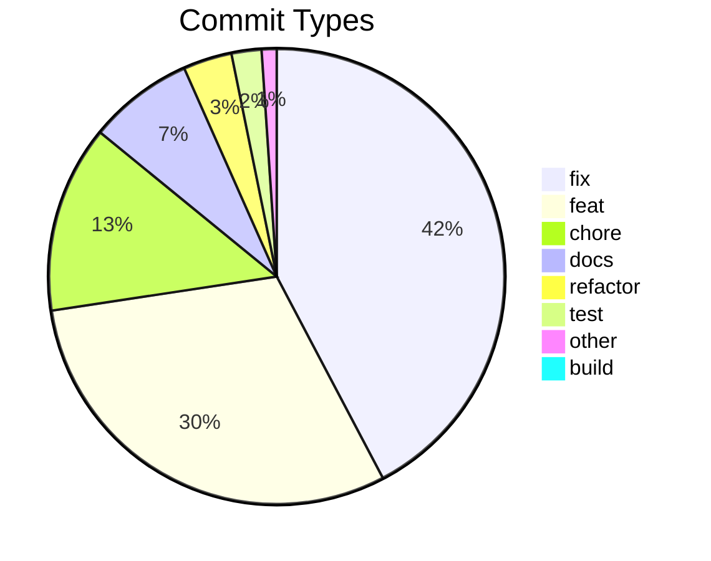

# Commit Change Log

Generated: 2026-05-20T08:43:11Z
Total commits: 377

## Commit Distribution

## Changes by Type

### Fixes (fix) — 159 commits

| Date | Scope | Description | Commit |
|------|-------|-------------|--------|
| 2026-05-19 | inbox | tighten card-internal top padding | 17b36748160b |
| 2026-05-19 | triage | assign new-iterate actionId on promote so launch injects the brief | 524cfdde30ea |
| 2026-05-19 | launch | flatten newlines in task descriptions instead of rejecting them | 47c76d882723 |
| 2026-05-19 | triage | carry the triage item detail into the promoted task description | 3c99c691c544 |
| 2026-05-19 | scripts | build the client too in start-server-production.ps1 | 86c81d23d6fc |
| 2026-05-19 | actions | emit --name as one cleanly-quoted token via {task.session_name} | ae2d0142c0e2 |
| 2026-05-18 | launch | carry the persisted task description on every fresh launch | d097820310da |
| 2026-05-18 | terminal | restore cursor visibility (DECTCEM) in replay snapshots | 3612407ba364 |
| 2026-05-18 | terminal | arm one-shot inject guard on a reused pty (survives reload) | 23f4a3831aec |
| 2026-05-16 | build | copy non-TS runtime assets into dist/ | ffdbe807c877 |
| 2026-05-16 | terminal | convertEol false eliminates left-column scroll smear (Bug B) | f08dd617fc31 |
| 2026-05-16 | terminal | replay drain gate eliminates reattach smear (ADR-108) | 316c0562c7b1 |
| 2026-05-15 | terminal | replay-snapshot remount smear + reset banner (ADR-104) | 1081cb7f7e7a |
| 2026-05-15 | triage | resolve 500 on Promote/Dismiss/Snooze (lock collision + self-deadlock) | 951dd3a18238 |
| 2026-05-15 | resume-cta | gate Resume on live JSONL write-time, not embedded-pty signal | 58acea263961 |
| 2026-05-15 | task-detail | redirect to task board after closing a task | bf6db4128a53 |
| 2026-05-15 | triage | apply external-code-review fixes missed by PR #17 staging | 7a78aeeb2d22 |
| 2026-05-15 | terminal | Iterate M (Resume CTA active-state) + K v10 (post-replay maintenance) | 28daae110740 |
| 2026-05-14 | terminal | post-launch-settle backstop for Resume-click-in-long-mounted-tab (ADR-099 v9) | 44102aaf9968 |
| 2026-05-14 | terminal | atlas-corruption workaround completes scroll-during-streaming (ADR-099 v8 + probe) | f07a66d45b71 |
| 2026-05-14 | terminal | post-mount maintenance for Resume-after-reload (ADR-099 v7) | e01bae984f12 |
| 2026-05-14 | terminal | immediate atlas maintenance on burst-after-quiet (ADR-099 v6) | 104435b2f4ca |
| 2026-05-14 | terminal | lightweight refresh in alt-screen for stale cursor (ADR-099 v5) | e9aa804c2563 |
| 2026-05-14 | terminal | skip atlas-clear in alt-screen buffer (ADR-099 v4) | bf7b05f6b8b5 |
| 2026-05-14 | client | swallow ECONN* in Vite dev WS proxy (ADR-099) | 05724ca05467 |
| 2026-05-14 | terminal | conditional atlas clear — skip when terminal idle (ADR-099) | f0ce31ab31ab |
| 2026-05-14 | terminal | tighten atlas-clear interval + add term.refresh() (ADR-099) | 4e8f9386b2e8 |
| 2026-05-14 | terminal | periodic + on-scroll clearTextureAtlas workaround (ADR-099) | bd9e3ea90aaa |
| 2026-05-14 | terminal | re-emit SGR mouse encoding after snapshot replay (ADR-099) | 814620c4b8b2 |
| 2026-05-14 | terminal | WebGL load-order + rescaleOverlappingGlyphs (ADR-099) | cd6b9f70610a |
| 2026-05-14 | server | refine new-plain Resume gate — emit --resume when JSONL exists | 9d1167eb8560 |
| 2026-05-14 | client | drop liveSession gating — Resume CTA always shows on idle/active | 0173d43b198f |
| 2026-05-13 | server | restore CLAUDE_CODE_NO_FLICKER=1 default (ADR-098 — Claude Code #37283 unresolved) | 8be89372475e |
| 2026-05-13 | server,client | preserve snapshot on pty-death + TaskCard Resume gating (ADR-096) | 17d75c96ebfc |
| 2026-05-13 | server,client | Claude TUI flicker env + Resume button gating (ADR-095) | 5807eb0c804e |
| 2026-05-13 | client | xterm.js Vorbild-Alignment — convertEol+WebGL+scrollback+proposedApi (ADR-093) | 6f715fcdff71 |
| 2026-05-12 | server | live-pty replay via serialize-on-attach + snapshot-on-detach (ADR-092) | c2d99f1c4326 |
| 2026-05-12 | server | mark @xterm/headless fixture as binary; pin LF-normalized size | b36981998879 |
| 2026-05-11 | server | skip disk-scrollback replay for new-plain on WS attach (ADR-086 v0.9.4) | fbfb44911758 |
| 2026-05-11 | server | new-plain Resume converges to active state (ADR-085 v0.9.3) | 4bb3799136c0 |
| 2026-05-11 | client | embedded-terminal mount-race regressions (ADR-084 v0.9.2) | 1cdeb9be68a5 |
| 2026-05-11 | server,test | wire boot-time Trusted-Origin policy into WS upgrade gate (ADR-083) | 660fd0df8bf9 |
| 2026-05-11 | cli-compat | use platform-aware path module in selfHealClaudePath | bdbc12db2d4a |
| 2026-05-10 | server | wire SHIPWRIGHT_NETWORK_PROFILE into Trusted-Origin policy | f852a36fd62c |
| 2026-05-10 | client | accept MagicDNS hostnames in Vite allowedHosts for tailscale profile | 5528ae20d222 |
| 2026-05-10 | dev | wire .env.local into both dev-server processes (ADR-082) | 447973645bc4 |
| 2026-05-09 | server,build | retire 4 documented tsc baseline errors (ADR-080) | 3ab3ad935e60 |
| 2026-05-09 | client | v0.8.9 — embedded-terminal replay-pushdown so live shell renders at viewport top | 98e8c984faa5 |
| 2026-05-08 | server,test | v0.8.8 — apply external code-review fixes (gemini + openai) | 2978aac0657f |
| 2026-05-08 | server,client | v0.8.7 — apply external code-review fixes (gemini + openai) | 5c5c5b13e970 |
| 2026-05-08 | server | v0.8.7 Stage 0 — new-plain `active → idle` when pty is gone (AC-1) | 0d4a608b4e45 |
| 2026-05-08 | terminal | v0.8.6 follow-up — scroll xterm to bottom after replay_end | a042f5b082a2 |
| 2026-05-07 | terminal | v0.8.6 Stage 1+2+3 — resize-dedupe kills banner accumulation (AC-2/AC-3); Spec 82 + AC-4 fix | d211323f0c18 |
| 2026-05-07 | client | v0.8.6 Stage 1+2+3 — Spec 82 empirical regression + AC-4 fix | 8c19ad97343d |
| 2026-05-07 | terminal | v0.8.6 Stage 0 — drop rounded corners on terminal wrapper (AC-1) | f521d18f8ca0 |
| 2026-05-07 | server | v0.8.5 Stage 3 — new-plain tasks transition to active on pty-up (AC-4) | fbc7540e7770 |
| 2026-05-07 | terminal | v0.8.5 Stage 2 — defensive xterm clear on replay_start (AC-3) | d0b6a41c9f17 |
| 2026-05-07 | terminal | v0.8.5 Stage 1 — remove Ctrl+V handler (AC-2) + Terminal-tab CTA (AC-6) | 5a56f005fad2 |
| 2026-05-07 | terminal | v0.8.5 Stage 0 — visual padding inside dark canvas (AC-1) | 838059954ebb |
| 2026-05-07 | server | v0.8.4 — Trusted-Origin gate honors HONO_HOST + WEBUI_TRUSTED_ORIGINS opt-in | d268f9b678b7 |
| 2026-05-07 | terminal | v0.8.3 follow-up — FileReader polyfill for jsdom Blob.text() | 0f9f9531b2d5 |
| 2026-05-07 | terminal | v0.8.3 Stage 2 — terminal canvas padding + footer inset | 334c20b08223 |
| 2026-05-07 | terminal | v0.8.3 Stage 1 — real Ctrl+V paste via attachCustomKeyEventHandler + clipboard.read | 6513a3c72d5a |
| 2026-05-06 | terminal | v0.8.2 follow-up — disclosure null-handling, Show-ignored toggle, live smoke spec 79 | c62e75914268 |
| 2026-05-06 | terminal | v0.8.2 polish — Spec 74 modal flake + xterm dark theme + Ctrl+V parity + paste latency + paste-dir migration + replay-only mode | d492d3aa9f9e |
| 2026-05-05 | terminal | post-v0.8 stabilization — scrollback ANSI sanitizer + writer-stuck watchdog | 69d2da326bc9 |
| 2026-05-05 | ui | suppress phase pill for Plain Claude tasks across all 3 surfaces | 5a7ed01a5a9d |
| 2026-05-05 | terminal | post-finalization UAT-fold — auto-launch reader→writer race + cumulative session fixes | a40bf273b62c |
| 2026-05-05 | terminal | Codex final-pass fold — Terminal CTA pure tab-flip + AC-16 about-to-run preview | c162925abad9 |
| 2026-05-05 | terminal | post-Phase-5 review fold — separate Stop terminal action + honest TTL disclosure copy | 632311234ffe |
| 2026-05-05 | terminal | post-Phase-3 external code review fold (8 HIGH + 4 MEDIUM) | e9d9366b8101 |
| 2026-05-04 | terminal | live-smoke-driven UX hardening (ADR-067 phase 6.2) | bbb6116154b1 |
| 2026-05-04 | terminal | post-second-review hardening + integration smoke fixes (ADR-067 phase 6.1) | 353fe79db902 |
| 2026-05-03 | terminal | post-code-review hardening (ADR-067 phase 6) | 6977d4387121 |
| 2026-05-02 | transcript | persist virtualizer measurements + cold-cache warmup (ADR-066) | 023bf16ba86a |
| 2026-05-01 | transcript | drop null-rendering events upstream of virtualizer (ADR-065) | f741fb9f622d |
| 2026-05-01 | transcript | disable browser scroll-anchoring in virtualized branch | 9595939e6dbd |
| 2026-05-01 | transcript | stabilize virtualized scroll-up with stable keys + frame-batched measurement | a4d118268998 |
| 2026-05-01 | transcript | render Claude Code task-notifications as a status chip | b69e1e03c7f9 |
| 2026-05-01 | webui | clicking a Projects row opens its TaskBoard, not Settings | c28b9b08d0ab |
| 2026-04-26 | webui | TaskList Phase column actually renders the phase | 69d9fd5bdd5c |
| 2026-04-26 | webui | phase persists across all launch paths + tighten title regex | a64360e5909c |
| 2026-04-25 | webui | ProjectContextStrip stops wrapping on narrow modal | e6fcd3ecf622 |
| 2026-04-25 | webui | unified ParamField alignment + phase fallback on TaskCard | db2208432eea |
| 2026-04-25 | webui | opt-in Advanced parameters + initial-prompt preview | 1cc5a740546c |
| 2026-04-25 | webui | skill flags belong in initial-prompt, not as Claude CLI args | b3496337f844 |
| 2026-04-24 | webui | hono server — loud bind errors via formatBindError | 066337706352 |
| 2026-04-24 | webui | dev-restart — computeKillTargets helper, drop hardcoded 5177 | 212f0743314b |
| 2026-04-24 | webui | tasklist-card-width — drop max-w-[90%] so it matches ToolCard | 5da6daf96da8 |
| 2026-04-24 | webui | hide last-prompt events from chat — pure noise | 14da0208a7a2 |
| 2026-04-24 | webui | system-pill-filter — hide custom-title/agent-name/permission-mode by default | dc0b62b26838 |
| 2026-04-24 | webui | chat-bubble-padding — widen horizontal inset from 22px to 40px | 0b543507b124 |
| 2026-04-24 | webui | status-stuck-on-awaiting-launch — re-launch flips back to active | 18404d117538 |
| 2026-04-23 | webui | tasklist-light-theme — switch TaskListCard from dark to light bg | b46466182595 |
| 2026-04-23 | webui | skillcard-and-code-bg — unwrap array content + anthracite code | 90614b4bab50 |
| 2026-04-23 | webui | mermaid-render-loop-fix — stabilize ReactMarkdown config identity (real cause was poll-driven remount) | fff784164b60 |
| 2026-04-23 | webui | mermaid-flicker-fix — move content-hash memo to DOM dataset for StrictMode resilience | 26056f1a520f |
| 2026-04-23 | webui | resume-cwd-prefix — extend cd prefix to legacy buildCopyCommands (Resume/Fork parity with Launch) | 2c24f1e268b0 |
| 2026-04-23 | webui | mermaid-in-markdown — render language-mermaid fences as SVG diagrams | a8e078097db8 |
| 2026-04-23 | webui | launch-cwd-prefix — shell-aware cd injection so pasted commands run in project root | 9b9e649a61df |
| 2026-04-23 | webui | cli-flag-fix — command template used --project-root, not a real Claude CLI flag | 3f8c40fd501f |
| 2026-04-23 | webui | shell-line-continuations — flatten copy command for PowerShell/cmd | 18cd1f1b0e89 |
| 2026-04-23 | webui | launch-command-wiring — route copied stub command, phase not persisted | be2f65a33854 |
| 2026-04-20 | webui | omit --session-id on plain resume (CLI 2.1+ rejects the combo) | 38cf0efaf06a |
| 2026-04-18 | webui/chat | AskUserCard multi-select + notBlocked banner + switch timeout | 263288aa162f |
| 2026-04-18 | webui/chat | UAT round 2 — new-task model, ghost bubble, resume UX, 409 retry | cd16669323e3 |
| 2026-04-18 | webui/chat | mid-task model switch UX + spawn indicator + empty-prompt guard | 169d816a770b |
| 2026-04-18 | webui/e2e | correct TaskDetailPage URL in sub-iterate A spec | e722b90aac4a |
| 2026-04-18 | webui/chat-settings | sub-iterate C — unify model state to concrete CLI ids | 05cb782769ff |
| 2026-04-17 | iterate14.14 | post-14.13 bug sweep (4 bugs) | 9866be11f7d3 |
| 2026-04-17 | iterate14.13 | send concrete model id + spawn/switch UX indicators | e5e9ad66fcd3 |
| 2026-04-16 | iterate14.10 | opus 4.7 correct id + auto mode CLI mapping + askusercard pause resume | ee30c0eedbb4 |
| 2026-04-16 | iterate14.8.1 | filterbar phase drift + priority removal + modebadge inline | 25f9aea8bb91 |
| 2026-04-16 | iterate14.8.0 | kanban phase mapping wire-through + sensible defaults | 54e36aa6b253 |
| 2026-04-15 | iterate14.7.0 | task persistence + all-projects view + reload state | 98dd446c5dfe |
| 2026-04-14 | webui,shared | iterate 12.0b — zombie-task reconciliation | 1077d5ff1fcb |
| 2026-04-14 | webui,plugins | revert inbox filter to latest-pending + expand phase dropdown | 3baf7893501b |
| 2026-04-14 | webui | drop /think slash prefixes — Claude CLI 2.1.1 removed them | d45a5956d8f3 |
| 2026-04-14 | webui,iterate13.1 | suppress markdown fallback after resolved AskUserQuestion | 39aba1d8ec4b |
| 2026-04-14 | webui,iterate | iterate 11.3 — first-pending inbox + replay timestamps + iterate-aware handoff | 41a9eba83b40 |
| 2026-04-13 | webui | inbox shows latest pending per task (revert iterate 11.1 zombie filter) | e8dd8dfafd9f |
| 2026-04-13 | webui | inbox dedupe by normalized question + zombie-task filter (ADR-024) | 3609f415dc19 |
| 2026-04-13 | webui | revert iterate-7 tool_result stdin + inbox filter + model selector + finalization verifier | 80ba19394402 |
| 2026-04-13 | webui | lock concurrent JSON writes (projects, pids, inbox, settings) | 68e6430120a6 |
| 2026-04-13 | hooks | filter shipwright runtime-artifact dirs from drift check | 216c5efa78fa |
| 2026-04-13 | webui | inbox projectId + chat-history replay + collapse AskUserQuestion noise + model/effort wire-through | 3da8810c1458 |
| 2026-04-13 | webui | persist task_cancelled/work_completed/task_updated to events.jsonl | f1b7cc7459ee |
| 2026-04-13 | webui | inbox answers send tool_result block + immediate Thinking + plugin scope + ADR budget | 1ad313e98a55 |
| 2026-04-13 | webui | TaskHeader redirects to kanban board after Close/Delete | 39e5cc892e9a |
| 2026-04-13 | webui | fatal startup errors (EADDRINUSE) must exit for tsx watch to retry | 0e2a1a3d485c |
| 2026-04-13 | webui | reset displayContent per turn + inbox id=toolUseId + dev-restart helper | d5973a8035c4 |
| 2026-04-13 | webui | correct AskUserQuestion schema + orange accent + thinking label + restart note | 626f5d876efa |
| 2026-04-13 | webui | kill chat duplication at the root + AskUserCard redesign + classifier tiebreak | cabf7b18d198 |
| 2026-04-13 | webui | AskUserQuestion card renders schema + dedupe double-render | 8b75623c809a |
| 2026-04-13 | webui | tool call cards transition Running→Done in place | 40179e71f3b5 |
| 2026-04-13 | webui | phase dropdown now authoritative in both start paths | 6d4da20ea2d8 |
| 2026-04-12 | webui | compact task header + tighter chat top padding | 27d4f24153b4 |
| 2026-04-12 | webui | permission popover closes on select, user bubble darker | 6d9369df415e |
| 2026-04-12 | webui | white claude cards, grey user bubble, VS Code permission modes | db1249e123d5 |
| 2026-04-12 | webui | persistent Claude process via --input-format stream-json | 6ceb568ac1b2 |
| 2026-04-12 | webui | flat chat, markdown tables, earlier streaming indicator | 57af8ca1bd2e |
| 2026-04-12 | webui | chat rendering matches mockup 11 — avatars, tool tiles, no horizontal scroll | e7690e5588f9 |
| 2026-04-12 | webui | interactive chat via re-spawn with --resume | 985db38bc675 |
| 2026-04-12 | webui | task lifecycle events — start transitions kanban status, exit completes task | f0a26566a355 |
| 2026-04-12 | webui | kanban columns scroll vertically when tasks overflow | 07c150945f97 |
| 2026-04-12 | webui | add min-h-0 to enable scroll on kanban board container | e7598007ba3f |
| 2026-04-12 | webui | enable page scrolling when tasks overflow viewport | 0e2c698533ed |
| 2026-04-12 | webui | bridge hardening — cross-platform stability | 79ab4643c7b0 |
| 2026-04-12 | webui | bridge working — Claude CLI spawns, responds, files created | 3d39a8e98df7 |
| 2026-04-12 | webui | CLI prompt sends title+desc, server crash fix, Windows auto-start | 76db5f3aa266 |
| 2026-04-12 | webui | test phase — title/desc split, autonomy refactor, model display, start button | 2daf7732b188 |
| 2026-04-11 | webui | PATCH URL, card menu Close+Delete, chat error handling | 64e33542e908 |
| 2026-04-11 | webui | task creation ENOENT fix + project delete button | 4c7b5594220b |
| 2026-04-11 | webui | task creation works, project dir initialized, keyboard shortcut fixed | be47100edc8c |
| 2026-04-11 | webui | task creation resilience + install.sh + guide + CRUD tests | 921ea873ef64 |
| 2026-04-11 | webui | UI test findings — logo, naming, wizard, shadows, dropdown, shortcuts | 5ccda98e76c4 |
| 2026-04-11 | e2e | use precise locators and handle backend-absent state | 234b1a23302f |
| 2026-04-11 | webui | resolve visual mockup deviations and 10 dead-write persistence gaps | f6fb9ad9980d |
| 2026-04-11 | server | replace __dirname with ESM-compatible import.meta.url | db137a78054b |

### Features (feat) — 114 commits

| Date | Scope | Description | Commit |
|------|-------|-------------|--------|
| 2026-05-19 | inbox | render markdown in text_question cards + fade-clip long bodies | 9b9149902756 |
| 2026-05-19 | inbox | surface waiting terminal pickers + focus terminal on Inbox click | e4309a5c2a12 |
| 2026-05-18 | terminal | keyboard copy/paste with multi-line paste fidelity | 086b72cebb82 |
| 2026-05-18 | taskdetail | default the Description block to collapsed | 41f8ceee4c5a |
| 2026-05-18 | tasks | add Edit Task dialog with lifecycle-gated field editability | 21e2941af9cd |
| 2026-05-18 | taskboard | move In-Progress tasks back to the Backlog column | 0610032f43ef |
| 2026-05-16 | resume-cta | always-available Resume, one-shot inject guard, menu copy actions | a520293fbf1f |
| 2026-05-15 | taskboard | project-identity pill on TaskCard meta row | 31bca147bc6d |
| 2026-05-15 | inbox | surface plain-text awaiting-user questions | 761f25fe1355 |
| 2026-05-15 | triage | WebUI Triage Tab + Promote bridge (FR-01.30, ADR-101) | 536f530f9b34 |
| 2026-05-14 | lead-foundation | add 13 optional ExternalTask fields for leadwright Phase 1 | c70f848c661d |
| 2026-05-13 | wizard | render stack-profile step dynamically from /api/profiles | b0e2aa44a193 |
| 2026-05-14 | server,client | introduce altScreenActive — hide Resume while TUI is foregrounded | 56b3b8a07c27 |
| 2026-05-14 | client | surface Resume CTA on state=active when pty is gone | 1525efd655af |
| 2026-05-11 | server,client | replay_snapshot envelope + flag flip + snapshot-store hardening (ADR-089) | 1612161135c7 |
| 2026-05-11 | server | wire @xterm/headless mirror behind feature flag (ADR-088 Iterate A) | ce5a1bbaa77b |
| 2026-05-10 | dev,build | SHIPWRIGHT_NETWORK_PROFILE env-flag for dev-server bind security (ADR-081) | 6827d97c9214 |
| 2026-05-08 | server | v0.8.8 — new-plain Resume fix + cli-compat robustness | 8c9f02d56884 |
| 2026-05-08 | client | v0.8.7 Stage 3 — historical-shell-sessions footer (AC-4) | 176687b94d10 |
| 2026-05-08 | server | v0.8.7 Stage 2 — replay-time PowerShell-banner-burst collapse (AC-3) | 4b3912766a90 |
| 2026-05-08 | server | v0.8.7 Stage 1 — shell-stopped marker on pty kill (AC-2) | 80d2e8a944ed |
| 2026-05-07 | server | HONO_HOST opt-in for non-loopback backend bind (default = loopback) | 6504911638fe |
| 2026-05-07 | client | VITE_HOST opts dev server into LAN/Tailscale binding | 0881461c6efe |
| 2026-05-05 | terminal | privacy disclosure footer + Spec 74 e2e (ADR-068-A1 phase 5) | 07dd22670721 |
| 2026-05-05 | terminal | DELETE cascade + Close-task-kills-pty + Clear-history modal (ADR-068-A1 phase 4) | 704f6f244f42 |
| 2026-05-05 | client | auto-launch via LaunchCoordinator + WS data-frame (ADR-068-A1 phase 3) | a50422d44dc0 |
| 2026-05-05 | terminal | pty integration + WS replay flow with pty.pause/resume (ADR-068-A1 phase 2) | da01e14445ed |
| 2026-05-05 | terminal | ScrollbackStore foundation — disk-backed scrollback (ADR-068-A1 phase 1) | f7d5101276bd |
| 2026-05-03 | terminal | Spec 73 + Spec 35 carve-out + CLAUDE.md / doc-sync (ADR-067 phase 5) | bb49091b1fec |
| 2026-05-03 | terminal | image-paste flow + .gitignore toast (ADR-067 phase 4) | 8af70ac95d63 |
| 2026-05-03 | client | TaskDetail Toggle-Tab + Launch-Flow integration (ADR-067 phase 3) | c2b7175e1355 |
| 2026-05-03 | client | EmbeddedTerminal + useTerminalSocket (ADR-067 phase 2) | 87bbf467ae21 |
| 2026-05-03 | terminal | pty-manager + WebSocket route foundation (ADR-067 phase 1) | fbcae762ee58 |
| 2026-05-01 | server | generate .code-workspace on project onboarding | a31594eb85d5 |
| 2026-05-01 | webui | wizard Advanced step accepts an actions.json upload | f2dfe89c58d4 |
| 2026-04-30 | webui | upload + reset .webui/actions.json from Settings | 28340d2e1211 |
| 2026-04-27 | webui | clickable Master TaskCard children navigate to shadow TaskDetail | 9071d77a4381 |
| 2026-04-27 | webui | e2e + docs for multi-session run-orchestrator (sub-iterate 7/7) | e1579d00234f |
| 2026-04-27 | webui | Continue Pipeline menu entry + modal (sub-iterate 5/7) | a3692dcea8ea |
| 2026-04-27 | webui | MasterTaskCard + Pipelines lane on TaskBoard (sub-iterates 4+6) | 5fa68e92f2ab |
| 2026-04-27 | webui | client lib + hooks for v2 run-config + Continue Pipeline (sub-iterate 3/7) | c5d00860f7f9 |
| 2026-04-26 | webui | phase-task launch path with server-side verification (sub-iterate 2/7) | d314ae49c25b |
| 2026-04-26 | webui | read shipwright_run_config.json schemaVersion 2 (sub-iterate 1/7) | c067b5afab94 |
| 2026-04-26 | webui | support custom action ids from .webui/actions.json | 8f19b9354c1e |
| 2026-04-25 | webui | plain Claude session as separate icon-button | bcbcf4ea7903 |
| 2026-04-25 | webui | required out of Advanced + phase-aware Autonomy + refetch survival | 494a615d469f |
| 2026-04-25 | webui | explicit enable-checkbox per Advanced parameter | 65a24bad7481 |
| 2026-04-25 | webui | phase.supports_autonomy schema field + boolean+required reject | b3944a4a7cda |
| 2026-04-25 | webui | live CLI parameters in CommandPreviewPanel | 700b7ee24136 |
| 2026-04-25 | webui | NewIssueModal Advanced parameters section | 95c70dae3847 |
| 2026-04-25 | webui | server-side CLI parameters resolution + validation | 2e6ff4327ac3 |
| 2026-04-24 | webui,project | cross-repo contract versioning for run-config + actions + profiles | f439ef818209 |
| 2026-04-23 | webui | task-list-unified — VS Code-style task list for TodoWrite + TaskCreate + TaskUpdate | 9c93df95dd00 |
| 2026-04-23 | webui | port-env-support — PORT/VITE_PORT for parallel dev-server stacks | 37dd17f6291c |
| 2026-04-23 | webui | chat-rendering-polish — align BubbleTranscript with bubble-states.html mockup (6 ACs) | c1c5697f8571 |
| 2026-04-23 | webui | adopt-phase — expose /shipwright-adopt via New Task dropdown | 5accb7bec757 |
| 2026-04-22 | webui | iterate 3 — design overhaul, project-task wiring, configurable actions, 3-pane TaskDetail | 2e057331a2c1 |
| 2026-04-20 | webui | iterate 2.3 — TaskBoard + Inbox UX + coverage gaps | f6579c628ec2 |
| 2026-04-19 | webui | iterate 2.2b — bubble layout + virtualization + auto-scroll | da5baa21fcc4 |
| 2026-04-19 | webui | iterate 2.2a — markdown rendering + parser hardening | 8d3b68a10236 |
| 2026-04-19 | webui | iterate 2.1 — launch-command --name flag + title rename | 652609ac6959 |
| 2026-04-19 | webui | external-launch pivot (Plan D'' variant a, Sub-iterates 0-2) | d25c03644a7c |
| 2026-04-18 | webui/chat | sub-iterate B — AUQ as first-class tool UI + stall instrumentation | edd6811c4a51 |
| 2026-04-18 | webui/chat-rendering | sub-iterate 0 — contract foundation | 458b844a047f |
| 2026-04-17 | iterate14.12 | mid-task model switching + settings.defaultMode wins over localStorage | 11d13f1739c0 |
| 2026-04-16 | iterate14.11 | task detail header pause indicator + resume button | 285e2479114e |
| 2026-04-16 | iterate14.9 | bug fixes + opus 7 + auto mode | 1e06e44b4479 |
| 2026-04-16 | iterate14.8.3 | chat composer stop + modelselector redesign + rest hydration | f50d987c6e1d |
| 2026-04-16 | iterate14.8.2 | settings defaults + project color + deep-link | dd70bf2b51e5 |
| 2026-04-15 | iterate14.7.2 | multi-project kanban with colored strips + filter chip | d7893a19f582 |
| 2026-04-15 | iterate14.7.1 | P1 UX polish bundle — model selector sync + paste buttons + inbox nav + mode badge + constitution rule | 0ea95f8c00e9 |
| 2026-04-15 | iterate14.6 | playwright e2e suite + dynamic model label | 3ff9a3b88c14 |
| 2026-04-15 | iterate14.5 | red flag banner for non-blocked AskUserQuestion | 21add97a5996 |
| 2026-04-15 | iterate14.4 | create menu + pipeline modal + linear-style shortcuts | 12a24e46c9db |
| 2026-04-15 | iterate14.2 | multi-question inbox with parts[] schema | 8fb90ce306d3 |
| 2026-04-15 | iterate14.1 | preview button + profile-loader + run plugin profile field | 79b9f303689c |
| 2026-04-15 | iterate14.0 | phase dropdown cleanup + iterate auto-detection | 4054b3e7f9d3 |
| 2026-04-14 | webui,iterate13 | flip to unified render, delete band-aids, remove env flag | 9bc50328de92 |
| 2026-04-14 | webui,iterate13 | expand useSSE with chat:message ChatMessage handler | 655c4b014da2 |
| 2026-04-14 | webui,iterate13 | add Zustand turnStatusStore + useTurnStatus selector | bb0e67a101df |
| 2026-04-14 | webui,iterate13 | add mergeCommitted pure helper with id dedupe and timestamp sort | ed3c82e954f1 |
| 2026-04-14 | webui,iterate13 | Phase 0 — broadcast extracted ChatMessages over SSE | 239b1a45a392 |
| 2026-04-13 | webui | probe claude CLI and show missing-CLI banner | b25183a1b36d |
| 2026-04-13 | hooks | content-aware CLAUDE.md drift detection | bd6d48ac34a5 |
| 2026-04-13 | webui | mid-task permission mode switching + autonomy sync to run_config | 183460db5df2 |
| 2026-04-13 | webui | phase detection for task creation | 236b3b2bbf8f |
| 2026-04-12 | webui | port companion markdown + left-align user msg + image upload | ef5c0eaed7a0 |
| 2026-04-12 | webui | chat rendering — persist all NDJSON types, real-time streaming, tool/thinking components | ca3facdbbbb9 |
| 2026-04-12 | webui | edit task modal, show description popover, guide install docs | 90f6b77496c7 |
| 2026-04-11 | client | add intent detection hint in chat input | 354a5f1070e8 |
| 2026-04-11 | client | implement Projects, Inbox, and Settings pages | 843adec3ab05 |
| 2026-04-11 | client | add card enrichment with classify and start task actions | c83bb4d56d50 |
| 2026-04-11 | client | implement 4-step project wizard with stack profiles | 5a1bba6755fd |
| 2026-04-11 | client | implement file explorer with directory tree and git status | 95c91779fc01 |
| 2026-04-11 | client | implement all viewer renderers — code, HTML, JSON, overlays | caef714db97e |
| 2026-04-11 | client | implement Smart Viewer with tab management and Markdown renderer | c1a0b6a346ff |
| 2026-04-11 | client | implement phase-to-status mapping with per-project overrides | 17064c756794 |
| 2026-04-11 | client | implement chat engine with messages, tools, and input toolbar | 22040c547ef0 |
| 2026-04-11 | client | implement Task Detail page with resizable two-panel layout | 725bb3dab6e7 |
| 2026-04-11 | client | add filter bar, view toggle, and sortable list view | 6b09068d87c4 |
| 2026-04-11 | client | add New Issue modal with background auto-classification | 7cbfdb670e20 |
| 2026-04-11 | client | implement Kanban board with columns, cards, and project tabs | 7418d5f44b69 |
| 2026-04-11 | client | add TanStack Query hooks, SSE integration, and API layer | 842f0bdf72aa |
| 2026-04-11 | client | add app shell with sidebar navigation and routing | 8ffe1cd20748 |
| 2026-04-11 | api | implement all REST API routes and wire up server entry point | e086fd7db7c8 |
| 2026-04-11 | sse | implement SSE manager with broadcast and route handler | 72702a2ba8e6 |
| 2026-04-11 | inbox | implement inbox manager and chat store | 6c34f784a1bd |
| 2026-04-11 | registry | implement project manager, config reader, and file watcher | a55043308ce9 |
| 2026-04-11 | governor | implement process governor with concurrency semaphore and heartbeat | f06953d27803 |
| 2026-04-11 | adapter | implement Claude CLI adapter with NDJSON stream parser | be8f553a8175 |
| 2026-04-11 | tasks | implement task manager with Kanban status derivation | bed5199fac60 |
| 2026-04-11 | events | implement event reader, writer, and in-memory event store | 871b60833db5 |
| 2026-04-11 | types | add shared TypeScript type definitions | 111b1ee75c90 |
| 2026-04-10 | server | scaffold Hono server with health endpoint, CORS, and error handling | b002cd6e5a40 |

### Chores (chore) — 50 commits

| Date | Scope | Description | Commit |
|------|-------|-------------|--------|
| 2026-05-20 | release | v0.14.0 | ebc9ece6b4c5 |
| 2026-05-19 | tooling | adopt oxlint and env-isolate the CORS test | e6683d698494 |
| 2026-05-18 | release | v0.13.0 | 5c121fe864f2 |
| 2026-05-17 | — | remove orphaned /shipwright-adopt e2e baseline | 48c2be0a585d |
| 2026-05-17 | release | v0.12.0 | 45fe9d2a8fb4 |
| 2026-05-16 | scripts | add production server start/stop scripts; align install-windows env-loading | d3cc52aca95a |
| 2026-05-16 | release | v0.11.1 | e6ee37967292 |
| 2026-05-15 | release | v0.11.0 | 14fb6dde3e43 |
| 2026-05-15 | compliance | add audit_config.json + gitignore generated audit report | 2e72b151a29b |
| 2026-05-14 | terminal | add ?atlasMaintenance=off kill switch + A/B regression probes (ADR-099) | d67ada696172 |
| 2026-05-11 | security | sync security.yml from monorepo (codeql v4 + continue-on-error) | 1c2508977ed5 |
| 2026-05-11 | workflows | drop dormant security + claude-review workflows from monorepo templates | 73a34e4a73b0 |
| 2026-05-10 | release | v0.9.0 | 4c559a7c7051 |
| 2026-05-08 | iterate | v0.8.8 finalization — CHANGELOG drops + ADR-078 (locally) | cdc7cd7082f1 |
| 2026-05-08 | iterate | v0.8.7 finalization — CHANGELOG drops + ADR-077 (locally) | c368094d0733 |
| 2026-05-08 | iterate | v0.8.6 AC-2 follow-up finalization — drop file + ADR-076a amendment (locally) | 00706517ebee |
| 2026-05-07 | iterate | v0.8.6 finalization — CHANGELOG drops + ADR-076 (locally) | ffb765dfbcc5 |
| 2026-05-07 | iterate | v0.8.5 finalization — CHANGELOG drops + ADR-075 (locally) | 5da6b6a92550 |
| 2026-05-07 | iterate | v0.8.4 finalization — CHANGELOG drop + ADR-074 (locally) | 8d90557a3c48 |
| 2026-05-07 | iterate | v0.8.3 finalization — CHANGELOG drops + ADR-073 (locally) | d658d1e93688 |
| 2026-05-06 | claude | drop suggest_iterate UserPromptSubmit hook | 97397d69b291 |
| 2026-05-06 | release | v0.8.1 | 998d23cf6a1f |
| 2026-05-05 | release | v0.8.0 | 3c847aef926b |
| 2026-05-05 | iterate | finalization artifacts for iterate-20260504-embedded-terminal-auto-launch-disk | 8d48225d82fc |
| 2026-05-04 | iterate | Fixed-category changelog drop for ADR-067 phase 6.2 fixes | 84a21c6aef90 |
| 2026-05-04 | iterate | Fixed-category changelog drop for ADR-067 phase 6.1 fixes | 1517e2e3934d |
| 2026-05-03 | iterate | Fixed-category changelog drop for ADR-067 phase 6 fixes | ffca237e74fd |
| 2026-05-03 | iterate | finalization artifacts for iterate-2026-05-03-embedded-terminal-launcher | c8f64e784823 |
| 2026-05-03 | release | v0.7.0 | 75b4a38bd3b3 |
| 2026-04-30 | adopt-cleanup | remove obsolete root dirs + harden .gitignore | 8c4191a64aef |
| 2026-04-30 | shipwright | adopt repository into Shipwright SDLC | 08b3ebf932c7 |
| 2026-04-27 | release | v0.6.0 | be1b5f555a3e |
| 2026-04-26 | release | v0.5.0 | 2b742e557776 |
| 2026-04-26 | release | v0.4.2 | 50bb358d7354 |
| 2026-04-26 | release | v0.4.1 | 8476bf670325 |
| 2026-04-25 | release | v0.4.0 | f1884f836bda |
| 2026-04-25 | release | v0.3.2 | b0e47782f3e3 |
| 2026-04-25 | release | v0.3.1 | 47ac4c15e050 |
| 2026-04-25 | release | v0.3.0 | 2d68102a156c |
| 2026-04-25 | release | v0.2.1 | d7e246a5c2db |
| 2026-04-25 | release | v0.2.0 | b46be35fd7a6 |
| 2026-04-24 | — | post-extraction setup — README, LICENSE, Makefile, CI, path rewrites | 5ab9e166fdd4 |
| 2026-04-19 | webui | server sweep + docs (Plan D'' Sub-iterate 3) | be6c8602086d |
| 2026-04-18 | webui/chat | re-remove deprecated components accidentally restored in e722b90 | b4a7bd0e975d |
| 2026-04-13 | webui | untrack shipwright_test_results.json | bff628c0baa7 |
| 2026-04-13 | webui | block pipeline artifacts and untrack e2e-results | 18bb454949b4 |
| 2026-04-13 | — | bump shipwright-run lock to 0.2.0, tweak TaskHeader spacing | db497ef5bff3 |
| 2026-04-12 | webui | retroactive iterate backfill for v0.1 triage (3 themes) | 81f3d0a00df3 |
| 2026-04-11 | test | add missing test prerequisites and design artifacts | eb43882cf8e8 |
| 2026-04-11 | client | scaffold Vite 6 + React 19 project with TailwindCSS 4 | 5e114b881034 |

### Documentation (docs) — 28 commits

| Date | Scope | Description | Commit |
|------|-------|-------------|--------|
| 2026-05-19 | changelog | record the triage-promote launch-chain fix | 3936dbd153ce |
| 2026-05-16 | — | note triage/ component dir in CLAUDE.md structure tree | b677f8f3dad8 |
| 2026-05-16 | — | align README + guide with embedded-terminal flow and Triage tab | d28c07e2fca8 |
| 2026-05-15 | readme | add Triage tab section (FR-01.30, ADR-101) | 07812ad1fff0 |
| 2026-05-14 | changelog | add two unreleased drops for CLAUDE.md alignment + Structure drift fix | e06a5eb01178 |
| 2026-05-14 | claude-md | align WHAT/Architecture rules to embedded-terminal auto-execute + close Structure drift | 25f7f6dc97a5 |
| 2026-05-14 | client | drop stale "nothing copies" from Save-to-Backlog tooltip | ca10944cb76e |
| 2026-05-14 | guide | align launch flow to embedded-terminal auto-execute | 6c9937f4eba5 |
| 2026-05-12 | server,test | sweep stale disk-first comment + tighten cursor axis assertion (E code-review follow-up) | 54ee271a0ddb |
| 2026-05-12 | terminal | sweep stale chunked-replay references post-ADR-087 (campaign code-review follow-up) | 7c17b0ea06ed |
| 2026-05-10 | guide | document SHIPWRIGHT_NETWORK_PROFILE + .env.local workflow | 78b7fbe02318 |
| 2026-05-08 | server,test | v0.8.7 — second-pass review fixes (timing safety doc + chunk-split test) | d40da77b2f41 |
| 2026-05-07 | terminal | v0.8.3 Stage 0 — disclosure footer mentions Claude image-cache path | 825cdcfba817 |
| 2026-05-07 | guide | add PowerShell + cmd.exe syntax for VITE_HOST | 27ceeb627ccf |
| 2026-05-04 | iterate | Phase 0 — ADR-068-A1 spec + DO-NOT regression guards (auto-launch + disk persistence) | 997ea42f2816 |
| 2026-05-01 | webui | document actions.json upload UI + Projects-row navigation | 01af8dc54650 |
| 2026-04-27 | webui | trim §6.7 framework concept to a one-sentence pointer | 96a3c5ba2722 |
| 2026-04-27 | webui | document multi-session pipelines + Continue Pipeline UX in guide.md | 55c907713a5c |
| 2026-04-26 | webui | drop confusing VS Code row from §3 recommended setup | 1635293411db |
| 2026-04-26 | webui | rewrite guide.md for VS Code + Claude Extension users | e7ea99baf874 |
| 2026-04-26 | webui | strict how-not-why rewrite of guide.md | f290056f68c5 |
| 2026-04-26 | webui | drop historical version references in guide.md | c3719f377f6e |
| 2026-04-26 | webui | add docs/guide.md as source of truth | c9ef68f9d3d7 |
| 2026-04-24 | webui, guide | honest parallel-worktree language + cache-drift pitfall | 7c95a67c78a3 |
| 2026-04-24 | webui | ADR-058 — three-fix bundle (status, padding, system pills) | 74d7e61a48b4 |
| 2026-04-20 | webui | iterate 2.4 — sync CLAUDE.md + ADR-035 | e2c3beb3b14c |
| 2026-04-13 | — | refresh README, guide, CLAUDE.md for Early Access first impression | 40adf8a78251 |
| 2026-04-11 | — | track agent_docs, planning, designs, and configs in git | 07b04211b083 |

### Refactoring (refactor) — 13 commits

| Date | Scope | Description | Commit |
|------|-------|-------------|--------|
| 2026-05-17 | terminal | remove orphaned Resume-CTA liveness-gate code | 641f639fecf5 |
| 2026-05-15 | triage | renumber ADR-104 → ADR-106 (number collision) | 3e3f04fb9b08 |
| 2026-05-15 | triage | white-surface cards + wizard-matched dialogs | 5e947423fb29 |
| 2026-05-13 | client | refresh NewIssueModal copy to match auto-execute flow | 9aae13a4252c |
| 2026-05-13 | client,server | upgrade xterm.js 5.5.0 -> 6.0.0 (ADR-097) | d96fa9b82e74 |
| 2026-05-12 | terminal | retire ADR-069/077/079/086 compensations; snapshot-only replay (ADR-087) | 2b8adc62933a |
| 2026-05-01 | transcript | left-align system chips + suppress autoscroll during user gesture | 3e45bd5de006 |
| 2026-05-01 | webui | polish actions-upload — Radix confirm + placeholder dry-run | d5e72ce583fa |
| 2026-04-24 | webui | profile-loader 3-tier cascade + bundled profiles snapshot | 8abba9bdde59 |
| 2026-04-23 | webui | chat-livetest-2 — 4 follow-ups to ADR-055 live-test | ecc62b72dad5 |
| 2026-04-23 | webui | chat-followups — 4 follow-ups to ADR-054 chat-rendering-polish | 39e5680b71de |
| 2026-04-18 | webui/chat | sub-iterate A — assistant-ui renderer foundation | f63576823048 |
| 2026-04-14 | webui | remove effort/thinking-depth UI and wire-through entirely | a6d04aeb7ed2 |

### Tests (test) — 8 commits

| Date | Scope | Description | Commit |
|------|-------|-------------|--------|
| 2026-05-12 | client | post-campaign E2E matrix for task types × scenarios (ADR-090) | 84c014cc059f |
| 2026-05-13 | e2e | migrate readXtermRows helper from DOM-locator to buffer-peek | b3bdf702e9cf |
| 2026-05-08 | e2e | v0.8.7 Spec 83 — empirical regression for AC-1/2/3/4 | fb9302371261 |
| 2026-05-07 | e2e | Spec 81 — v0.8.5 terminal fixes empirical regression (AC-1/AC-4/AC-6) | 513832781640 |
| 2026-05-06 | e2e | Spec 77 — fixture timing fix found by live smoke run | 868c58efdd00 |
| 2026-04-20 | webui | iterate 2.5 — bump spec 33 + 37c tolerances for full-suite | 4f66978a3520 |
| 2026-04-11 | — | complete test phase — 299 unit tests, 5 E2E tests, smoke PASS | b4309b4170d5 |
| 2026-04-11 | e2e | set up Playwright with E2E specs and smoke test results | 7aba77a0232f |

### Other (other) — 4 commits

| Date | Scope | Description | Commit |
|------|-------|-------------|--------|
| 2026-05-01 | — | Revert "Merge iterate/overflow-anchor-virtualized: disable browser scroll-anchoring in virtualized branch (ADR-063)" | 72770920a055 |
| 2026-04-23 | — | iterate 3.9 — E2E spec backlog cleanup + TaskCard menu-bubbling fix (#9) | 322377673234 |
| 2026-04-22 | — | iterate 3.8 — post-iterate-3 cleanup (E2E + scrollbar gutter) (#8) | 581215062282 |
| 2026-04-17 | — | poc: assistant-ui migration probe (branch poc/assistant-ui-migration) | 7a5230370ba7 |

### Build (build) — 1 commits

| Date | Scope | Description | Commit |
|------|-------|-------------|--------|
| 2026-04-26 | webui | autostart script builds server too + launches via node | 3d23763075e2 |

## AI Attribution

| Metric | Value |
|--------|-------|
| Total commits | 377 |
| AI-assisted commits | 0 |
| Human-authored commits | 377 |

