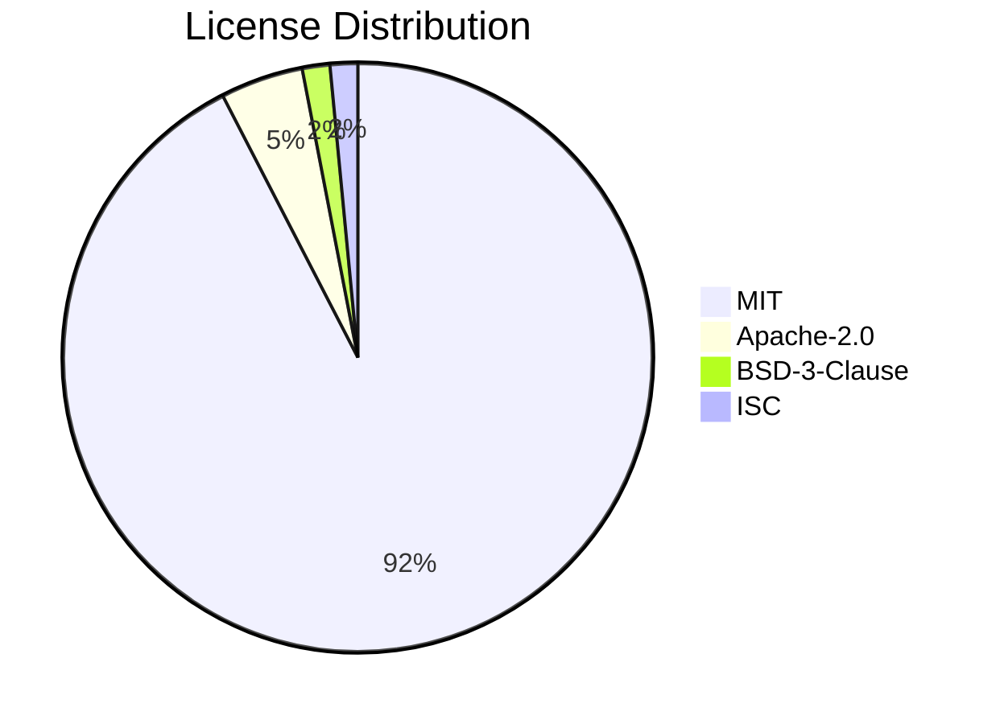

# Software Bill of Materials (SBOM)

Generated: 2026-06-27T07:34:15.471587+00:00

## Summary

| Metric | Value |
|--------|-------|
| Runtime dependencies | 43 |
| Dev dependencies | 23 |
| Total packages | 66 |
| Unique licenses | 4 (Apache-2.0, BSD-3-Clause, ISC, MIT) |
| Copyleft licenses | 0 |

## License Distribution

## Runtime Dependencies

| Package | Version | License |
|---------|---------|---------|
| @dnd-kit/core | ^6.3.1 | MIT |
| @hono/node-server | ^1.14.0 | MIT |
| @hono/node-ws | ^1.3.1 | MIT |
| @lydell/node-pty | ^1.1.0 | MIT |
| @radix-ui/react-dialog | ^1.1.0 | MIT |
| @radix-ui/react-dropdown-menu | ^2.1.0 | MIT |
| @radix-ui/react-popover | ^1.1.15 | MIT |
| @radix-ui/react-select | ^2.1.0 | MIT |
| @radix-ui/react-tabs | ^1.1.0 | MIT |
| @radix-ui/react-tooltip | ^1.1.0 | MIT |
| @tanstack/react-query | ^5.0.0 | MIT |
| @tanstack/react-virtual | ^3.13.24 | MIT |
| @tiptap/extension-link | ^2.27.2 | MIT |
| @tiptap/pm | ^2.27.2 | MIT |
| @tiptap/react | ^2.27.2 | MIT |
| @tiptap/starter-kit | ^2.27.2 | MIT |
| @xterm/addon-fit | 0.11.0 | MIT |
| @xterm/addon-serialize | 0.14.0 | MIT |
| @xterm/addon-web-links | 0.12.0 | MIT |
| @xterm/addon-webgl | 0.19.0 | MIT |
| @xterm/headless | 6.0.0 | MIT |
| @xterm/xterm | 6.0.0 | MIT |
| diff | ^5.2.2 | BSD-3-Clause |
| hono | ^4.7.0 | MIT |
| ignore | ^5.3.2 | MIT |
| lucide-react | ^0.400.0 | ISC |
| mermaid | ^11.14.0 | MIT |
| p-queue | ^9.2.0 | MIT |
| proper-lockfile | ^4.1.0 | MIT |
| react | ^19.0.0 | MIT |
| react-dom | ^19.0.0 | MIT |
| react-markdown | ^10.1.0 | MIT |
| react-resizable-panels | ^2.1.9 | MIT |
| react-router-dom | ^7.0.0 | MIT |
| rehype-highlight | ^7.0.2 | MIT |
| rehype-raw | ^7.0.0 | MIT |
| rehype-sanitize | ^6.0.0 | MIT |
| rehype-slug | ^6.0.0 | MIT |
| remark-gfm | ^4.0.1 | MIT |
| shell-quote | ^1.8.3 | MIT |
| strip-ansi | ^7.2.0 | MIT |
| tiptap-markdown | ^0.8.10 | MIT |
| zustand | ^4.5.7 | MIT |

## Dev Dependencies

| Package | Version | License |
|---------|---------|---------|
| @playwright/test | ^1.59.1 | Apache-2.0 |
| @tailwindcss/vite | ^4.0.0 | MIT |
| @testing-library/jest-dom | ^6.0.0 | MIT |
| @testing-library/react | ^16.0.0 | MIT |
| @testing-library/user-event | ^14.0.0 | MIT |
| @types/diff | ^7.0.2 | MIT |
| @types/node | ^25.6.2 | MIT |
| @types/node | ^22.0.0 | MIT |
| @types/proper-lockfile | ^4.1.4 | MIT |
| @types/react | ^19.0.0 | MIT |
| @types/react-dom | ^19.0.0 | MIT |
| @types/shell-quote | ^1.7.5 | MIT |
| @vitejs/plugin-react | ^4.0.0 | MIT |
| jsdom | ^25.0.0 | MIT |
| msw | ^2.0.0 | MIT |
| oxlint | ^1.66.0 | MIT |
| tailwindcss | ^4.0.0 | MIT |
| tsx | ^4.21.0 | MIT |
| tsx | ^4.19.0 | MIT |
| typescript | ^5.6.0 | Apache-2.0 |
| typescript | ^5.7.0 | Apache-2.0 |
| vite | ^6.0.0 | MIT |
| vitest | ^4.1.8 | MIT |

## License Compliance

No license concerns: all resolved dependencies are permissively licensed.

