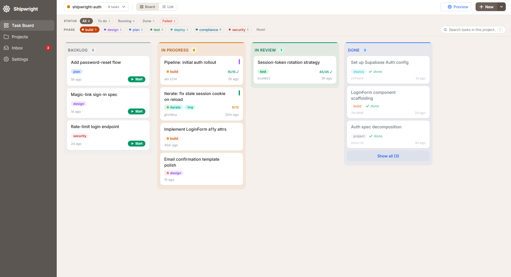
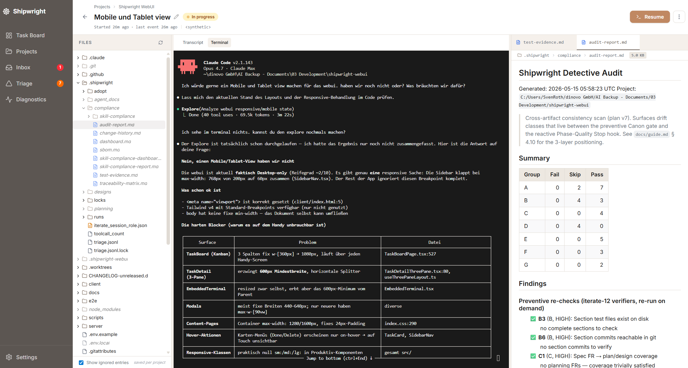

# Shipwright Command Center

> ### Ship right, not just fast.


> **One Kanban board for every Claude Code project you run in parallel,
> without giving up the terminal workflow you already love.**

<table>
<tr>
<td width="50%"></td>
<td width="50%"></td>
</tr>
<tr>
<td><em>Kanban board across every Shipwright project: Backlog, In Progress, In Review, Done. One place to see where everything stands.</em></td>
<td><em>Task detail: embedded terminal, Project File Viewer, Markdown Editor.</em></td>
</tr>
</table>

> **Beta:** the Command Center is in active beta: it's built and used
> daily to run Shipwright itself, but you're an early user, so expect the
> occasional rough edge.
> [Report an issue](https://github.com/svenroth-ai/shipwright-webui/issues/new/choose).
> Feedback is very welcome.

**Shipwright** is the harness your AI follows, the discipline layer
that keeps your project's context **true** as it changes. On every
change it re-checks the work against your requirements, architecture,
and decisions, and blocks anything that silently drops a requirement
or reverses a past call. The **Command Center** is the board that
surfaces all of it: every project, every task, every agent question,
in one place.

Local web app that observes and orchestrates multiple Claude Code
sessions in parallel. Works alongside the [Shipwright SDLC
plugins](https://github.com/svenroth-ai/shipwright) but runs as a
standalone tool: you click **Launch** on a task and the pre-bound
`claude --session-id <uuid> …` command auto-runs in an **embedded
terminal pane** (xterm.js + a real shell, right on the task page). The
Command Center watches the resulting JSONL transcript at
`~/.claude/projects/<cwd>/<uuid>.jsonl` to render a live kanban board,
chat transcript, inbox, triage, and diagnostics for every registered
project.

**Architectural rule of record**: the web server
spawns **no** Claude process. The embedded terminal hosts only a
whitelisted shell; your click on Launch authorizes that shell, and the
Claude command runs inside it. The Command Center stays a read-only
observer of the JSONL transcript.

**Full docs:** [`docs/guide.md`](docs/guide.md). The friendly,
non-expert walkthrough: installation, your first project, daily
workflow, updates, autostart, network access, custom actions for your
own slash skills, and troubleshooting. This README gets you running;
the guide goes deeper.

## What you get

- **One Kanban board across every project:** Backlog → In Progress →
  Done, no tab-juggling between background terminals.
- **Live transcript per task:** read what Claude is doing right now in
  chat style, refreshed every second.
- **Embedded terminal** on each task page: hit **Launch** and the
  pre-bound `claude` command auto-runs right there.
- **Inbox:** every "Claude needs permission…" prompt pinned in one
  place, across all projects.
- **Triage:** pre-backlog findings from Shipwright's quality, security,
  and compliance hooks, ready to promote into tasks.
- **Diagnostics:** CLI version, session count, watcher health at a
  glance.

It's optional (every Shipwright skill works fine without it), but once
you have more than one project running in parallel, it stops being a
luxury. See the [user guide](docs/guide.md) for the full tour.

## Get started

**Prerequisites:** Node.js 20+, Git, and the Claude Code CLI ≥ 2.1.114
(the pinned `MIN_SUPPORTED_CLI`). No databases, no Docker, no Python, no
system services. Verify each:

```bash
node --version       # v20.x.x or higher
git --version
claude --version     # 2.1.114 or higher
```

**One command — install _and_ update the whole system** (the `/shipwright-*`
plugins **and** the Command Center), first run and every run after:

```bash
npx @svenroth-ai/shipwright@latest
```

It verifies prerequisites, installs/updates every plugin from the marketplace
manifest (and syncs the plugin cache so their hooks actually run), then boots
the Command Center on **:3847** and opens it — or, if one is already running,
attaches to it (an older one is swapped in place). The bundled server + client
are **built**, so re-running the command **is** the update: no clone, no
`make`, no `git pull`. Always include `@latest` (a bare `npx` can reuse a stale
cached copy; the tool also warns you when a newer version is published).

Open **http://localhost:3847** and register your first project. The
wizard walks you through stack-profile selection.

<details>
<summary><strong>From source</strong> (contributors, or to run an unpublished checkout)</summary>

The repo is two independent workspaces with no root `package.json`:

```bash
# 1. Get the code
git clone https://github.com/svenroth-ai/shipwright-webui.git
cd shipwright-webui

# 2. Install dependencies (npm install in both server/ and client/)
make install

# 3. Build both halves once
make build

# 4. Start the server (it serves the UI too)
cd server && npm start
```

> **No `make`?** (Common on Windows.) Run the npm scripts directly:
> `cd server && npm install && npm run build`, then
> `cd ../client && npm install && npm run build`, then
> `cd ../server && npm start`.

</details>

> **Two independent workspaces, no root `package.json`.** `server/` and
> `client/` each carry their own `package.json` + lockfile, so dependencies
> install per package: `cd server && npm ci`, then `cd client && npm ci`
> (`npm ci` gives a clean, lockfile-reproducible install; `make install`
> just runs both for you).

On **Windows**, have the server start automatically on every login. See
[Autostart](#autostart-on-windows) below. The full walkthrough,
first-project guide, network/Tailscale access, custom actions, and
troubleshooting all live in [`docs/guide.md`](docs/guide.md).

## Updating

Re-run the one command — it updates the plugins **and** swaps the running
Command Center in place (safe to run from inside its own embedded terminal):

```bash
npx @svenroth-ai/shipwright@latest
```

From a source checkout instead:

```bash
git pull
make install        # only when dependencies changed
make build          # rebuild the compiled server/dist + client/dist
cd server && npm start   # restart (stop the old one with Ctrl+C first)
```

The production server runs the **compiled** output, so a `git pull` alone
won't show new changes until you rebuild. A one-step rebuild + restart
helper ships for both platforms — `scripts\start-server-production.ps1`
(Windows) and `scripts/start-server-production.sh` (macOS / Linux).
See [guide §7](docs/guide.md#7-updating-the-command-center).

## Develop or contribute

Editing the Command Center's own code? Run the two halves as hot-reload
dev servers instead (`make dev-server` on `:3847` + `make dev-client` on
`:5173`, open `:5173`). That flow, plus the standalone-vs-monorepo
profile loop (`SHIPWRIGHT_MONOREPO_PATH`) and parallel-worktree port
overrides (`PORT` / `VITE_PORT`), is documented in
[guide §4 Path B](docs/guide.md#4-installation) and [`CLAUDE.md`](CLAUDE.md).
Contributor norms: [`CONTRIBUTING.md`](CONTRIBUTING.md).

## Autostart on Windows

```powershell
powershell -ExecutionPolicy Bypass -File scripts\install-windows.ps1
```

Installs dependencies, builds both halves, and creates a hidden `.vbs`
launcher in `~\.shipwright-webui\` that starts the server on login. After
your next login the **full dashboard** is live at http://localhost:3847.
No Vite or `make dev-client` needed. Custom port via `-Port <n>`;
uninstall with `-Uninstall`.

## Architecture

- Hono (Node 20+) + React 19 (Vite 6) + TailwindCSS 4 + Radix UI.
- Embedded terminal pane per task: xterm.js in the browser, node-pty
  on the server, restricted to a shell-binary whitelist (never `claude`
  directly). Launch auto-runs the command via a client-side WebSocket
  data-frame; the server never spawns Claude.
- No chat composer, no SSE transcript, no chokidar. 1 s client polling
  with byte-range reads; the server is stateless on transcript requests.
- Multi-project task metadata persisted at
  `~/.shipwright-webui/{projects,sdk-sessions,settings}.json` with
  `proper-lockfile` guarded writes.
- Claude JSONL discovery is filename-first (`<uuid>.jsonl`); first-line
  sessionId is the sanity check.
- Detailed internals + load-bearing DO-NOT guards in [`CLAUDE.md`](CLAUDE.md)
  and `.shipwright/agent_docs/decision_log.md`.

## Triage tab

The `/triage` route surfaces pre-backlog findings from
`<project>/.shipwright/triage.jsonl`: items written by Phase-Quality,
compliance, security/performance/F0.5/drift hooks (the producer pattern
documented in
[shipwright/docs/triage-inbox.md](https://github.com/svenroth-ai/shipwright/blob/main/docs/triage-inbox.md)).

For each registered project, the page lists items with `status==triage`
grouped by source (alphabetical), severity-rank-sorted within each
group. Click an item → detail modal with four actions:

- **Fix now:** opens the New-Issue modal pre-filled from the finding
  (title, description, priority, domain) so launching the task is one
  more click. `github-source` items route to a `phase=security` task;
  every other source routes to a new iterate. Use it when you've decided
  to act on the finding immediately.
- **Promote:** creates an `ExternalTask` carrying a
  `promotedFromTriageId` back-ref + auto-merged tags
  `["source:<x>", "severity:<sev>", "triage:<id>"]`, then flips the
  triage item to `status==promoted`. Idempotent on retry: a 207
  partial-promote (status flip failed) returns the new `taskId` so retry
  reuses it. No orphan tasks.
- **Dismiss:** appends `status==dismissed` with optional reason. The
  finding will re-emerge under a NEW triage id if it re-fires.
- **Snooze:** appends `status==snoozed` with optional reason. Hides the
  item until the underlying issue re-fires (which produces a new triage
  id). There is no timed wake-up in this iterate.

Sidebar shows `Triage (N)` (orange badge, distinct from Inbox red)
aggregated across all registered projects, polling every 30 s with
exponential backoff on 5xx.

See
[shipwright/docs/triage-inbox.md](https://github.com/svenroth-ai/shipwright/blob/main/docs/triage-inbox.md)
for the cross-store contract + producer-side details.

## Contract with Shipwright plugins

The WebUI reads but never writes:

- `<project>/shipwright_run_config.json`: only `.profile` (Preview gate)
- `<project>/shipwright_*_config.json`: existence check for adoption state

The WebUI writes only:

- `<project>/.shipwright-webui/actions.json`: empty stub on demand; user-editable
- `<project>/.shipwright/triage.jsonl`: appends `status` events from
  Promote / Dismiss / Snooze actions. Never writes
  `append` events (those come from producer hooks).
- `~/.shipwright-webui/*.json`: own registry

Both artefacts carry a `contractVersion` / `schemaVersion` integer.
Readers warn once on drift and keep going. Never fails a read.

## Acknowledgments

The Shipwright Command Center adopts patterns from these open-source
projects:

- **[obra/superpowers](https://github.com/obra/superpowers)** (MIT,
  © Jesse Vincent): Iron-Law verification language and the anti-slop
  PR-template framing (`.github/PULL_REQUEST_TEMPLATE.md`).
- **[multica-ai/andrej-karpathy-skills](https://github.com/multica-ai/andrej-karpathy-skills)**
  (MIT, © 2025 multica-ai): the four Karpathy principles, cited
  verbatim in the sibling shipwright repo's `shared/constitution.md`
  and applied to webui changes via the PR template's Anti-Slop
  Self-Check section.
- **[multica-ai/multica](https://github.com/multica-ai/multica)**
  (Apache-2.0 *modified*, hosting-restricted). Architectural patterns
  only, inspiring the Command Center roadmap: WebSocket transcript
  streaming (replaces 1 s JSONL polling), multi-workspace isolation,
  runtime registry (Claude Code · Codex CLI · Copilot CLI · Gemini CLI
  as pluggable adapters), and the "parse don't cast" rule for
  cross-plugin `shipwright_*_config.json` reads. **No code or text is
  copied:** patterns only, deliberately, so this repo stays cleanly
  MIT.

The companion shipwright monorepo carries its own Acknowledgments block
covering the same sources plus
[addyosmani/agent-skills](https://github.com/addyosmani/agent-skills)
(MIT, © Addy Osmani; five-axis review framework, used in the sibling
repo's reviewer prompts, not directly in this webui).

## License

[MIT](LICENSE)

Built by [svenroth.ai](https://github.com/svenroth-ai). Powered by Claude Code.
